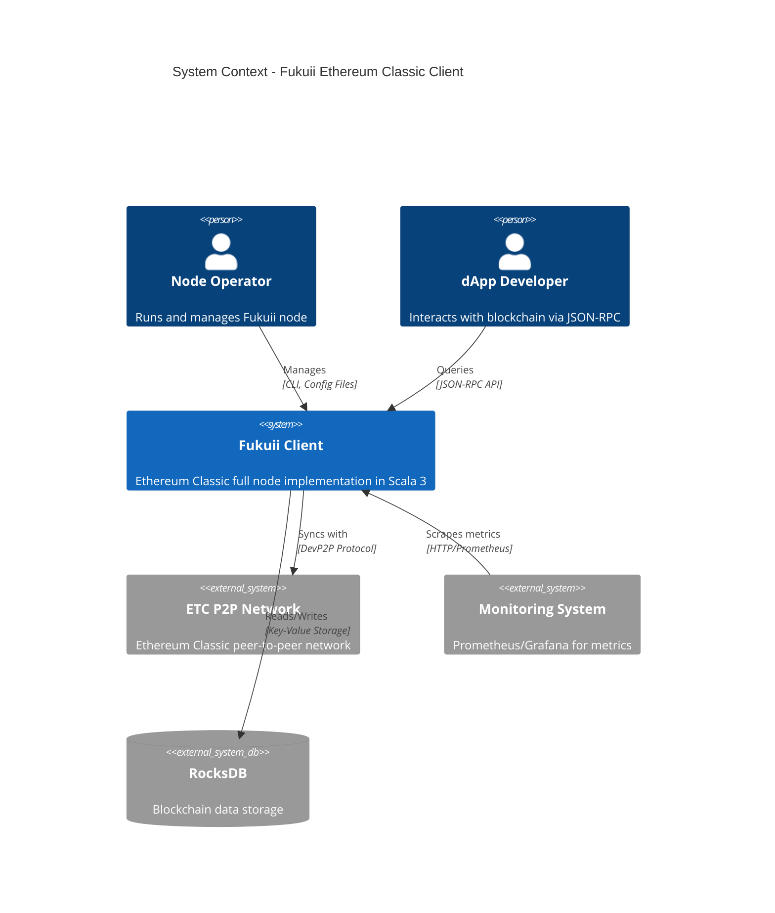
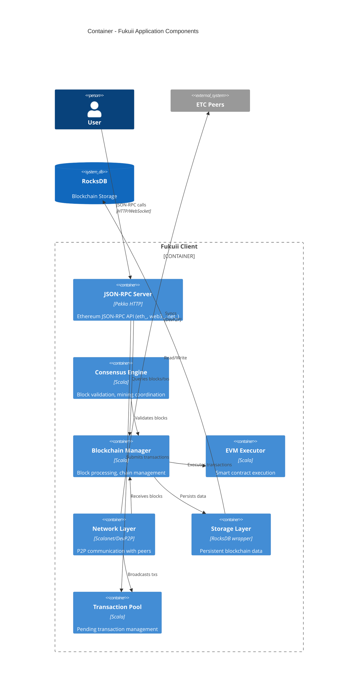
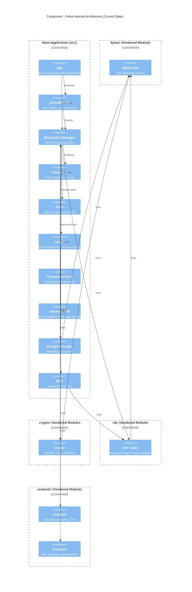

# Fukuii Application Architecture - C4 Diagrams

This document contains C4 architecture diagrams for the Fukuii Ethereum Classic client, showing the current state with vendored modules and the proposed integrated architecture.

## System Context Diagram (Level 1)

Shows Fukuii in the context of its users and external systems.



## Container Diagram (Level 2)

Shows the high-level technical building blocks of Fukuii.



## Component Diagram (Level 3) - Current State

Shows the internal structure of Fukuii with vendored modules as separate SBT subprojects.



## Component Diagram (Level 3) - Proposed Integrated State

Shows how the architecture will look after fully incorporating vendored modules into the main application.

```mermaid
C4Component
    title Component - Fukuii Fully Integrated Architecture (Proposed)

    Container_Boundary(main, "Main Application (src/)") {
        Component(app, "App", "Main entry point")
        Component(jsonrpc_api, "JSON-RPC API", "API endpoints")
        Component(blockchain_mgr, "Blockchain Manager", "Block processing")
        Component(consensus_eng, "Consensus", "PoW/mining")
        Component(evm_exec, "EVM", "Contract execution")
        Component(ledger, "Ledger", "State management")
        Component(tx_pool, "Transaction Pool", "Mempool")
        Component(storage_mgr, "Storage", "DB layer")
        Component(mpt, "MPT", "Merkle trie")
        
        Component_Boundary(utils, "Utils Package") {
            Component(bytes_int, "Bytes Utils", "Previously bytes/ module")
        }
        
        Component_Boundary(crypto_pkg, "Crypto Package") {
            Component(crypto_int, "Crypto Utils", "Previously crypto/ module")
            Component(crypto_app, "App Crypto", "Application crypto logic")
        }
        
        Component_Boundary(rlp_pkg, "RLP Package") {
            Component(rlp_int, "RLP Codec", "Previously rlp/ module")
            Component(rlp_app, "App RLP", "Application RLP logic")
        }
        
        Component_Boundary(network_pkg, "Network Package") {
            Component(network_p2p, "P2P Layer", "Peer management")
            Component(scalanet_int, "Scalanet", "Previously scalanet/ module")
            Component(discovery_int, "Discovery", "Previously scalanet/discovery")
        }
    }

    Rel(app, jsonrpc_api, "Initializes")
    Rel(blockchain_mgr, consensus_eng, "Validates")
    Rel(blockchain_mgr, evm_exec, "Executes")
    Rel(network_p2p, scalanet_int, "Uses")
    Rel(network_p2p, discovery_int, "Uses")
    Rel(consensus_eng, crypto_int, "Uses")
    Rel(evm_exec, crypto_int, "Uses")
    Rel(mpt, rlp_int, "Uses")
    Rel(crypto_int, bytes_int, "Uses")
    Rel(rlp_int, bytes_int, "Uses")
```

## Architecture Comparison

### Current State: Multi-Module SBT Build

**Structure:**
- 5 separate SBT projects (node, bytes, crypto, rlp, scalanet)
- Explicit `.dependsOn()` relationships in build.sbt
- Each module compiles independently
- Cross-project dependencies managed by SBT
- Can publish modules separately (currently disabled)

**Pros:**
- Clear module boundaries
- Can version modules independently
- Parallel compilation of independent modules

**Cons:**
- Complex build.sbt configuration
- Slower overall build due to dependency resolution
- IDE integration challenges
- Artificial barriers to refactoring

### Proposed State: Single Module

**Structure:**
- Single SBT project with all code in src/
- Package-based organization for logical separation
- Unified compilation process
- Internal dependencies only

**Pros:**
- Simpler build configuration
- Faster compilation and testing
- Better IDE support
- Easier refactoring across boundaries
- No cross-project dependency issues

**Cons:**
- Less enforced separation (mitigated by clear package structure)
- All code compiled together

## Module Responsibilities

### bytes
**Purpose**: Foundation utilities for byte manipulation  
**Key Classes**: `Hex`, `ByteStringUtils`, `ByteUtils`  
**Dependencies**: None  
**Used By**: crypto, rlp, storage, network

### crypto
**Purpose**: Cryptographic operations for Ethereum  
**Key Classes**: `ECDSASignature`, `ECIESCoder`, `SymmetricCipher`, zkSNARK implementations  
**Dependencies**: bytes  
**Used By**: consensus, evm, blockchain, network

### rlp
**Purpose**: Recursive Length Prefix encoding/decoding  
**Key Classes**: `RLP`, `RLPDerivation`, `RLPImplicits`  
**Dependencies**: bytes  
**Used By**: blockchain, mpt, network, storage

### scalanet
**Purpose**: Low-level networking and peer discovery  
**Key Packages**: TCP networking, Kademlia DHT, peer discovery  
**Dependencies**: None (on other vendored modules)  
**Used By**: network layer, P2P communication

## Related Documentation

- [Vendored Modules Integration Plan](VENDORED_MODULES_INTEGRATION_PLAN.md) - Detailed implementation plan
- [Repository Structure](../REPOSITORY_STRUCTURE.md) - Current repository organization
- [ADR-001: Scala 3 Migration](adr/001-scala-3-migration.md) - Context on why modules were vendored

## References

- [C4 Model](https://c4model.com/) - Architecture diagram notation
- [SBT Multi-Project Builds](https://www.scala-sbt.org/1.x/docs/Multi-Project.html)
- [Scala Package Objects](https://docs.scala-lang.org/tour/package-objects.html)
