# SNAP Protocol Architecture

**Status:** Authoritative — supersedes `SNAP_SYNC_IMPLEMENTATION.md`, `SNAP_SYNC_ACTOR_CONCURRENCY.md`, `SNAP_SYNC_ACTOR_IMPLEMENTATION.md`
**Branch:** `staging`
**Last updated:** 2026-05-20
**Audience:** engineers debugging or extending SNAP sync; operators tuning a Fukuii node

---

## 1. Overview

SNAP sync is the Ethereum state-snapshot protocol (snap/1, [devp2p spec](https://github.com/ethereum/devp2p/blob/master/caps/snap.md)). Instead of replaying transactions or downloading intermediate trie nodes, a SNAP-syncing node downloads:

- **Account ranges** (256-bit keyspace divided into N chunks)
- **Contract storage ranges** (per-account storage tries)
- **Bytecodes** (content-addressed by codeHash)
- **Trie nodes** (for the small set of gaps left after the snapshot)

then verifies the result against a pivot block's state root.

Fukuii's implementation reached production-readiness on the `staging` branch with two large reworks in May 2026:

| PR | Change | Effect |
|----|--------|--------|
| #1266 | `StackTrie` default for accounts | Eliminated multi-GiB pivot trie; ~3,700–4,000 acc/sec sustained (vs ~950 declining) |
| #1273 | Per-account streaming `SnapHashTrie` for storage | Capped heap at `max-concurrent-storage-accounts × 8 MiB` ≈ 2 GiB, **independent of chain size** |
| #1259 | CL-anchored pivot refresh | Post-merge correctness — pivot tracks consensus head, not stale peer-reported best |
| #1260 | PoW chain weight from wire TD | Pre-merge correctness — total-difficulty from ETH/68 wire message, not estimate |
| #1232 | Inter-coordinator backpressure | Storage queue ≤100k pending; prevents account/storage runaway |
| #1255/#1256 | Strike-counted peer demotion | Tolerates transient empty responses (5 strikes vs 3) |
| #1188 | Healing validated-root cache | Skip duplicate state validation when trie walk confirms clean |

The rest of this document describes the resulting architecture in detail.

### Reading guide

| You are… | Read… |
|----------|-------|
| New to SNAP in Fukuii | §2 (Actor hierarchy), §3 (Controller FSM), §4 (Phase pipeline) |
| Debugging a pivot/post-merge issue | §5 (Pivot selection), §6 (Pivot refresh) |
| Investigating OOM or throughput regression | §8 (Memory & water marks), §9 (Backpressure) |
| Investigating a stuck/stalled sync | §6 (Pivot refresh), §10 (Peer quality), §11 (Healing/validation), §13 (Fallback) |
| Tuning the node | §14 (Configuration reference) |

Deep-dive cross-references (kept docs):
- `docs/adr/protocols/ADR-SNAP-001-protocol-infrastructure.md` — wire-format spec
- `docs/architecture/SNAP_SYNC_BYTECODE_IMPLEMENTATION.md`
- `docs/architecture/SNAP_SYNC_STATE_VALIDATION.md`
- `docs/architecture/SNAP_SYNC_ERROR_HANDLING.md`
- `docs/operations/monitoring-snap-sync.md`
- `docs/runbooks/snap-sync-*.md`

---

## 2. Actor Hierarchy

SNAP sync is a multi-coordinator actor system on Pekko. The supervision tree:

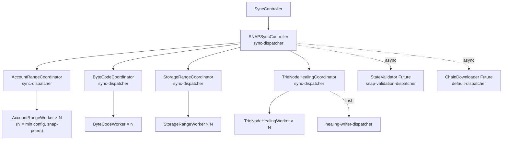

Key facts:

- **All coordinators are created up front** (`SNAPSyncController.scala:1472`, in `startSnapSync()` → `launchAccountRangeWorkers()` at line 2340-2450). Healing coordinator is created lazily when the healing phase begins (`startStateHealingWithInterleave()` at line 2800).
- **Concurrent download phases.** Account, bytecode, and storage coordinators all live simultaneously from the first account response onward. The phase FSM (`SyncPhase`, §4) tracks *which one gates progression*, not which one is running.
- **Dispatcher isolation.** All actors run on `sync-dispatcher` so they cannot starve the JSON-RPC HTTP server. State validation (long trie walks) runs on a dedicated `snap-validation-dispatcher`; healing flushes run on `healing-writer-dispatcher`.
- **Workers are stateful pools.** Each worker has a 2-state internal FSM (`idle` / `working`). Workers are dispatched by their coordinator and report results back; they don't talk to each other.

Source files (all under `src/main/scala/com/chipprbots/ethereum/blockchain/sync/snap/`):

| Component | File | Lines |
|-----------|------|-------|
| Controller | `SNAPSyncController.scala` | 4,160 |
| Account coord. | `actors/AccountRangeCoordinator.scala` | ~1,600 |
| Account worker | `actors/AccountRangeWorker.scala` | — |
| Bytecode coord. | `actors/ByteCodeCoordinator.scala` | — |
| Bytecode worker | `actors/ByteCodeWorker.scala` | — |
| Storage coord. | `actors/StorageRangeCoordinator.scala` | ~1,400 |
| Storage worker | `actors/StorageRangeWorker.scala` | — |
| Healing coord. | `actors/TrieNodeHealingCoordinator.scala` | ~400 |
| Healing worker | `actors/TrieNodeHealingWorker.scala` | — |
| Messages | `actors/Messages.scala` | — |
| Streaming trie | `SnapHashTrie.scala` | 120 |
| State validator | `StateValidator.scala` | — |
| Chain downloader | `ChainDownloader.scala` | — |

---

## 3. Top-Level Controller FSM

The `SNAPSyncController` itself has a four-state Pekko FSM (the `receive` partial functions):

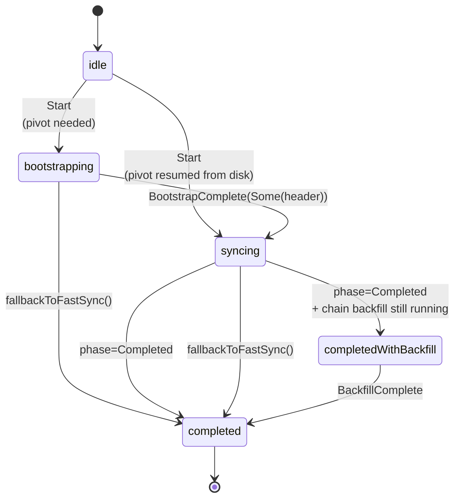

| State | File:line | Purpose |
|-------|-----------|---------|
| `idle` | `SNAPSyncController.scala:369` | Awaits `Start` from parent `SyncController`. Buffers any `CLPivotHint` arriving early. |
| `bootstrapping` | `SNAPSyncController.scala:1186` | Awaits pivot block header from peer via `StartRegularSyncBootstrap`. Exponential-backoff retry on `PivotBootstrapFailed` (2s→4s→…→60s cap, max 10 retries). |
| `syncing` | `SNAPSyncController.scala:381` | Main working state. Multiplexes all phase messages (`AccountRangeResponseMsg`, `*PivotRefreshed`, `*Complete`, validation, healing, periodic ticks). |
| `completed` | `SNAPSyncController.scala:1427` | Replies `SyncDone` to status queries; signals parent. |
| `completedWithBackfill` | `SNAPSyncController.scala:3683` | SNAP state finished but chain backfill (`completedWithBackfill`) still catching up to pivot. |

The `syncing` state is the meaty one: it composes `handlePeerListMessagesWithRateTracking` with phase-specific handlers and dispatches on `currentPhase` (the `SyncPhase` ADT — see §4).

---

## 4. Sync Phase Pipeline

The `SyncPhase` ADT (`SNAPSyncController.scala:3785-3792`) tracks progress through the data-download pipeline, independent of the receive-state above:

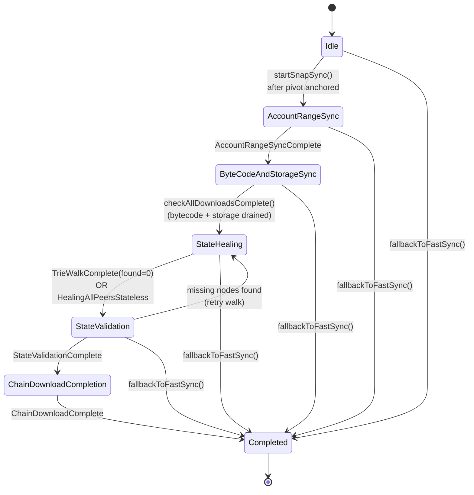

| Phase | Entry trigger | Exit signal | Live coordinators | Notes |
|-------|---------------|-------------|-------------------|-------|
| `Idle` | — | `startSnapSync()` | none | Pre-pivot |
| `AccountRangeSync` | `startSnapSync()` after pivot anchored | `AccountRangeSyncComplete` | Account, Bytecode, Storage | Bytecode/Storage receive `AddByteCodeTasks` / `AddStorageTasks` inline as accounts arrive |
| `ByteCodeAndStorageSync` | `AccountRangeSyncComplete` | `checkAllDownloadsComplete()` | Bytecode, Storage | Accounts drained; per-peer budget rebalanced via `UpdateMaxInFlightPerPeer` |
| `StateHealing` | All downloads drained | `TrieWalkComplete(found=0)` (2nd-pass clean) | Healing | Async trie walk runs in parallel and feeds healer |
| `StateValidation` | Walk says clean | `StateValidationComplete` | none | Spawns 2 async Futures (account trie + storage tries) on validation dispatcher |
| `ChainDownloadCompletion` | Validation passed | `ChainDownloadComplete` | — | Waits for parallel `ChainDownloader` to reach pivot |
| `Completed` | Chain at pivot | — | — | Signals `SnapSyncFinalized(pivot)` then `Done` |

### 4.1 Per-Phase Per-Peer Budget

`UpdateMaxInFlightPerPeer(newLimit)` (`actors/Messages.scala:17`) rebalances each coordinator's per-peer pipelining when the phase changes. Geth-aligned: every peer is held to a total of ~5 concurrent requests across all coordinators.

| Phase | Account | Bytecode | Storage | Healing |
|-------|---------|----------|---------|---------|
| AccountRangeSync | 5 | 2 | 2 | — |
| ByteCodeAndStorageSync | — | 3 | 3 | — |
| StateHealing | — | — | — | 1 |

(Healing is serialized per peer like go-ethereum and Besu; throughput comes from `healing-batch-size = 128`, not concurrency. See `sync.conf:84-94`.)

---

## 5. Pivot Selection: PoW vs CL-Driven vs Local

The pivot block defines *which* state root SNAP downloads. Three sources, prioritized:

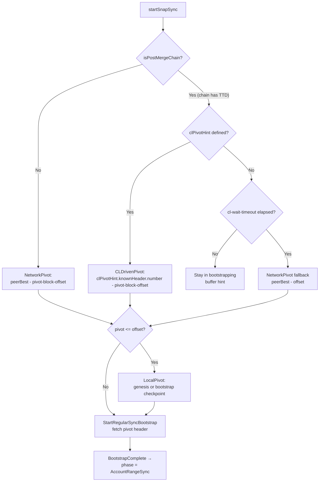

| Source | `PivotSelectionSource` | When | Computation |
|--------|------------------------|------|-------------|
| `NetworkPivot` | line 3798 | Pre-merge, healthy peers | `peerBest - pivot-block-offset` (TD-based; chain weight from wire TD, fixed in #1260) |
| `CLDrivenPivot` | line 3808 | Post-merge with FCU received | `clPivotHint.knownHeader.number - pivot-block-offset` (PR #1259, closes #1207) |
| `LocalPivot` | line 3801 | Bootstrap from checkpoint or genesis | Hardcoded checkpoint (e.g. ETC Spiral: block 19,250,000) or genesis |

### 5.1 CL Hint Flow (post-merge chains)

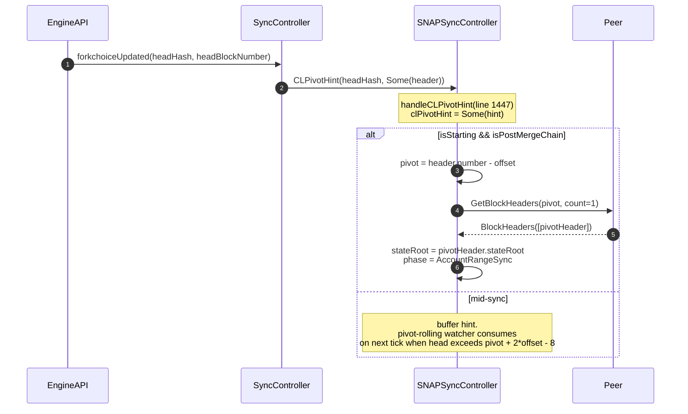

Key guards:

- **`pivotPassesFreshnessFloor`** (`SNAPSyncController.scala:2976`) — when refreshing pivot on a post-merge chain, reject any peer-reported best that is *older* than the CL-anchored floor. Prevents backward pivot drift caused by lagging peers.
- **`cl-wait-timeout`** — post-merge chains with no `CLPivotHint` yet hold in `bootstrapping`. Falls back to peer-best after timeout (or stays indefinitely if the gate is strict).

### 5.2 Pre-Merge Chain Weight (#1260)

For PoW pivots, the parent `SyncController` previously estimated chain weight as `header.difficulty × blockNumber`, which drifted significantly on long forks. PR #1260 switched to the real cumulative TD reported in the ETH/68 `Status` wire message (`peer.peerInfo.remoteStatus.totalDifficulty`). The change also adds an abort-on-missing-parent-weight guard to backfill, which previously could silently seed a corrupted weight when the backfill batch started before pivot TD was persisted.

---

## 6. Pivot Refresh

The pivot ages as the chain advances. Three triggers cause a refresh:

1. **Proactive roll** — when `head > pivot + 2*offset - 8` (geth pattern), refresh before the pivot becomes unservable.
2. **Stagnation recovery** — `account-stagnation-timeout = 60s` (`sync.conf:123`) with no completion → refresh.
3. **CL head advance (post-merge)** — new `CLPivotHint` consumed at next tick.

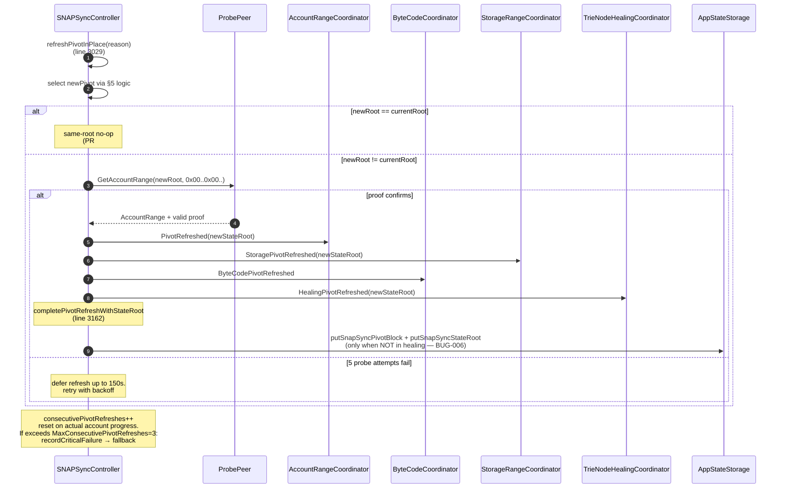

### 6.1 Pivot Readiness Probe (#1222)

For proactive rolls only, the controller probes the candidate root with `GetAccountRange(newRoot, 0x00…, 0x00…, responseBytes=512KB)` before notifying coordinators. If the probed peer hasn't indexed the new block yet (typical 30-60s window after block import), the controller defers the notification (max 5 attempts, 150s total). This eliminated a ~8-minute dead window during which coordinators would drain in-flight tasks against a stateless root.

### 6.2 Same-Root No-Op (#1236/#1258)

If the freshly-selected pivot has the same state root as the current one (common on small chains or right after CL FCU with no new state), the refresh is a no-op:

- Don't notify coordinators (avoid spurious `drainActiveTasks`).
- Don't reset `consecutivePivotRefreshes` or `snaplessPeers`.
- Don't rewrite `AppStateStorage` (no churn).

The fix in PR #1258 specifically caught the `completePivotRefreshWithStateRoot` path which previously *always* triggered a full restart even on identical roots.

### 6.3 Coordinator-Side Handling

Each coordinator's `*PivotRefreshed` handler does the same three things:

1. **Re-target pending tasks** to the new root (in-place, no requeue).
2. **Drain in-flight tasks** (`drainActiveTasks` — `AccountRangeCoordinator.scala:339`) — sends `WorkerRequestCancelled(requestId)` to each affected worker so workers cancel their `SNAPRequestTracker` entries and return to `idle` without emitting `TaskFailed`.
3. **Clear `snaplessPeers` set** (PR #1255) — peers demoted under the old root get a fresh strike budget for the new root.

ByteCodes are content-addressed (hash-keyed), so `ByteCodePivotRefreshed` only clears stale peer tracking — completed bytecodes remain valid across pivot changes.

---

## 7. Coordinator ↔ Worker Protocol

All four coordinators follow the same dispatch loop. Illustrated for AccountRange (other phases parameterize the message names):

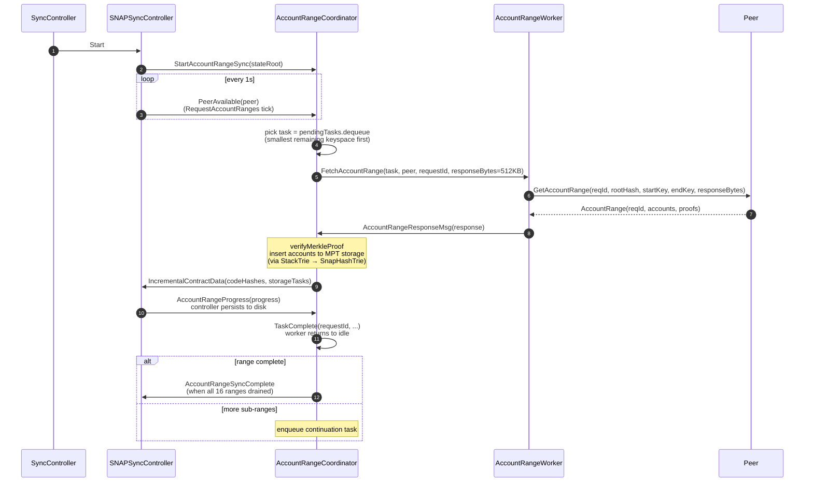

### 7.1 Inline Contract Dispatch (geth-aligned)

`IncrementalContractData(codeHashes, storageTasks)` (`SNAPSyncController.scala:3849-3852`) is emitted by the account coordinator after each batch — bytecode and storage tasks are populated inline, not after account download finishes. This is the geth pattern: bytecodes start downloading immediately, and storage downloads overlap with account downloads from the first response.

This is why all three coordinators are alive concurrently throughout `AccountRangeSync` (§4).

### 7.2 Per-Phase Message Sets

| Phase | Coordinator messages | Worker messages |
|-------|----------------------|------------------|
| Account | `StartAccountRangeSync`, `PeerAvailable`, `TaskComplete`, `TaskFailed`, `PeerUnavailable`, `PivotRefreshed`, `AccountRangeProgress`, `StorageQueuePressure`, `ByteCodeQueuePressure`, `RecoverStalledAccountTasks`, `CheckDispatchStalled`, `CheckCompletion`, `GetContractAccounts`, `GetUniqueCodeHashes`, `GetStorageFileInfo`, `GetCodeHashesFileInfo` | `FetchAccountRange`, `AccountRangeResponseMsg`, `RequestTimeout`, `WorkerPeerDisconnected`, `WorkerRequestCancelled` |
| Bytecode | `StartByteCodeSync`, `AddByteCodeTasks`, `NoMoreByteCodeTasks`, `ByteCodePivotRefreshed`, `ByteCodePeerAvailable`, `ByteCodeTaskComplete`, `ByteCodeTaskFailed`, `ByteCodeCheckCompletion`, `ForceCompleteByteCodes` | `FetchByteCodes`, `ByteCodesResponseMsg`, `ByteCodeRequestTimeout` |
| Storage | `StartStorageRangeSync`, `AddStorageTasks`, `StoragePeerAvailable`, `StoragePivotRefreshed`, `NoMoreStorageTasks`, `StorageTaskComplete`, `StorageTaskFailed`, `ForceCompleteStorage`, `FlatBatchFlushComplete`, `FlatBatchFlushFailed` | `FetchStorageRanges`, `StorageRangesResponseMsg`, `StorageRequestTimeout` |
| Healing | `StartTrieNodeHealing`, `QueueMissingNodes`, `HealingPeerAvailable`, `HealingPivotRefreshed`, `HealingTaskComplete`, `HealingTaskFailed`, `HealingStagnated`, `WalkStateChanged`, `HealingForceComplete` | `FetchTrieNodes`, `TrieNodesResponseMsg`, `HealingRequestTimeout` |

Full definitions live in `src/main/scala/com/chipprbots/ethereum/blockchain/sync/snap/actors/Messages.scala`.

---

## 8. Memory Management

The dominant memory engineering challenge for SNAP on a chain with tens of millions of accounts is keeping heap usage **independent of chain size**. Prior to the May 2026 rework, three things grew with N:

1. The global pivot trie (legacy `MerklePatriciaTrie` over `DeferredWriteMptStorage`).
2. The set of in-flight storage tries (one per contract account).
3. The set of contract code hashes (one per contract; passed to bytecode phase).

Each was OOMing at ~9.5M accounts on ETC mainnet. The current design replaces each with a bounded structure.

### 8.1 Data Flow

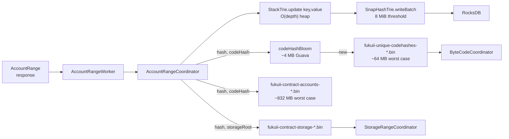

### 8.2 StackTrie (PR #1266)

`StackTrie` (`src/main/scala/com/chipprbots/ethereum/mpt/StackTrie.scala`) is a **streaming Merkle Patricia Trie builder** ported from geth's `trie/stacktrie.go`. Keys must arrive in strict ascending order; as each new key arrives, the trie finalises the leftmost sibling nodes that can no longer change, emits them via callback, and discards them from memory.

- **Heap bound:** O(trie depth) — the live working set is the rightmost path from root to most recent leaf. ~6–16 nodes for a 10M-entry trie.
- **Toggle:** `snap-sync.use-stack-trie = true` (`sync.conf:27`).
- **Effect:** Eliminated the ~4 GiB legacy pivot trie and its multi-minute flush stall.

### 8.3 SnapHashTrie Per-Account Streaming (PR #1273)

`SnapHashTrie` (`src/main/scala/com/chipprbots/ethereum/blockchain/sync/snap/SnapHashTrie.scala:49`) wraps a `StackTrie` and adds a **byte-budgeted batch flush**:

```scala
val DefaultBatchSizeBytes: Int = 8 * 1024 * 1024   // SnapHashTrie.scala:118
```

Each contract storage trie gets its own `SnapHashTrie`. When the pending batch reaches 8 MiB it flushes to RocksDB via the `writeBatch` callback (configurable per construction at `SnapHashTrie.scala:51`) and clears its buffer.

With `max-concurrent-storage-accounts = 256` (`sync.conf:66`), worst-case storage-processing heap is **256 × 8 MiB = 2 GiB**, independent of chain size. Brand-new storage accounts are deferred when the cap is hit; continuations of in-flight accounts proceed.

### 8.4 File-Backed Contract Index

ETC mainnet has ~13M contracts. Holding their hashes/roots in memory would consume ~1.6 GB. Instead, `AccountRangeCoordinator` writes them to temp files:

```scala
// AccountRangeCoordinator.scala:390-393
private val contractAccountsFile: Path = Files.createTempFile("fukuii-contract-accounts-", ".bin")
private val contractStorageFile: Path  = Files.createTempFile("fukuii-contract-storage-", ".bin")
private val contractAccountsOut = new BufferedOutputStream(new FileOutputStream(contractAccountsFile.toFile), 65536)
private val contractStorageOut  = new BufferedOutputStream(new FileOutputStream(contractStorageFile.toFile), 65536)
```

- 64 bytes per entry (32-byte accountHash + 32-byte codeHash/storageRoot).
- ~832 MB worst case on disk, near-zero heap.
- **Lifecycle:** Created in `preStart`; `contractAccountsFile` deleted in `postStop` (line 568); `contractStorageFile` and `uniqueCodeHashesFile` are *not* deleted by the coordinator — the controller manages their lifecycle after handoff to bytecode/storage phases (lines 569-571).

### 8.5 Bytecode Bloom Dedup (Bug 20 fix)

ETC's 73.5M raw `(accountHash, codeHash)` entries would mean a 4.7 GB file to read at bytecode-handoff time — caused the 5s ask timeout that silently skipped bytecode sync. Fix: unique codeHashes via a Guava Bloom filter:

```scala
// AccountRangeCoordinator.scala:405-411
private val codeHashBloom: BloomFilter[ByteString] =
  BloomFilter.create[ByteString](ByteStringFunnel, 3_000_000, 0.0001)  // ~4 MB
private val uniqueCodeHashesFile: Path =
  Files.createTempFile("fukuii-unique-codehashes-", ".bin")
```

Account processing checks the bloom; on miss, appends to `uniqueCodeHashesFile` and puts into the bloom. The 73.5M raw entries collapse to ~2M unique codeHashes ≈ 64 MB on disk.

### 8.6 High/Low Water Marks Reference

All of these are defined in source; this table is the central reference.

| Watermark | Default | File:line | Purpose |
|-----------|--------:|-----------|---------|
| Storage pending **high** | 100,000 | `StorageRangeCoordinator.scala:69` | Trigger `StorageQueuePressure(paused=true)` → account dispatch paused |
| Storage pending **low** | 50,000 | `StorageRangeCoordinator.scala:70` | Release backpressure |
| Account trie flush threshold | 50,000 nodes | `sync.conf:134` (`account-trie-flush-threshold`) | RocksDB flush boundary (~20 MB in heap) |
| `SnapHashTrie` batch size | 8 MiB | `SnapHashTrie.scala:118` (`DefaultBatchSizeBytes`) | Per-account batch flush threshold |
| Max concurrent storage accounts | 256 | `sync.conf:66` (`max-concurrent-storage-accounts`) | Cap on live `SnapHashTrie` instances (≈ 2 GiB heap ceiling) |
| Bloom filter capacity | 3 M / 0.0001 FPR | `AccountRangeCoordinator.scala:405` | codeHash dedup before file spill |
| Empty-response strikes | 5 | `AccountRangeCoordinator.scala:143`, `StorageRangeCoordinator.scala:150` | Peer → snapless (was 3, PR #1256) |
| Account stagnation timeout | 60 s | `sync.conf:123` (`account-stagnation-timeout`) | Trigger pivot refresh (was 180s, PR #1257) |
| Account dispatch stall timeout | 90 s | `AccountRangeCoordinator.scala:308` (`noActivityTimeoutMs`) | `drainActiveTasks` on wedged in-flight tasks (Bug #1184) |
| Storage dispatch stall timeout | 120 s | `StorageRangeCoordinator.scala` | Mark ghost peers stateless |
| Healing stagnation timeout | 5 min | `TrieNodeHealingCoordinator.scala:60` (`healingStagnationTimeoutMs`) | Force-complete healing if no progress |
| Healing flush threshold | 1,000 nodes | `TrieNodeHealingCoordinator.scala:199` (`rawFlushThreshold`) | Batch RocksDB flushes on healing dispatcher |
| Max in-flight per peer | 5 total | `sync.conf:128` (`max-inflight-per-peer`) | Geth-aligned per-peer pipelining cap |
| Max critical SNAP failures | 5 | `sync.conf:111` (`max-snap-sync-failures`) | Threshold for fallback to fast sync |
| Max consecutive pivot refreshes | 3 | `SNAPSyncController.scala` (`MaxConsecutivePivotRefreshes`) | Refresh-loop circuit breaker |
| Adaptive response size (acct) | 102 KB → 2 MB | `sync.conf:138-141` | Ratchet 1.25× up / 0.5× down per peer |
| Adaptive response size (storage) | 131 KB → 2 MB | `sync.conf:56-59` | Same algorithm, denser responses |
| Snap capability grace period | 30 s | `sync.conf:115` (`snap-capability-grace-period`) | Wait for snap/1 peers before fallback |
| Preserved pivot distance | 256 blocks | `SNAPSyncController.scala` (`MaxPreservedPivotDistance`) | Range progress survives pivot drift |

### 8.7 Persistence Checkpoints

`AppStateStorage` (`src/main/scala/com/chipprbots/ethereum/db/storage/AppStateStorage.scala`) provides durable, namespaced keys used to survive process crashes:

| Key | When set | Purpose |
|-----|----------|---------|
| `SnapSyncPivotBlock` | At pivot anchor (before any download starts) | Resume target |
| `SnapSyncStateRoot` | Together with `SnapSyncPivotBlock` | State root to verify against |
| `SnapSyncProgress` | After each batch | Account ranges and contract-task progress |
| `SnapSyncAccountsComplete` | When `AccountRangeSyncComplete` fires | Allows resume to skip directly to bytecode+storage |
| `SnapSyncDone` | At `phase = Completed` | Gates transition to regular sync |
| `BootstrapPivotBlock` | At bootstrap | Highest known checkpoint |
| `BootstrapPivotBlockHash` | At bootstrap | Hash for that checkpoint |

`isSnapSyncInProgress()` returns true if any of `{PivotBlock, StateRoot, Progress}` is set AND `SnapSyncDone` isn't. The Phase-5 DB consistency check uses this to skip the "best block hash in block storage" check while mid-SNAP — necessary because SNAP holds only the pivot header, not the full chain (yet).

---

## 9. Inter-Coordinator Backpressure

Without backpressure, the account coordinator races ahead and the storage queue grows unbounded. On Sepolia (May 2026), this hit 2.8M pending storage tasks → 4 GB heap consumed by completed-task refs → OOM. PR #1232 introduced the high/low-water protocol.

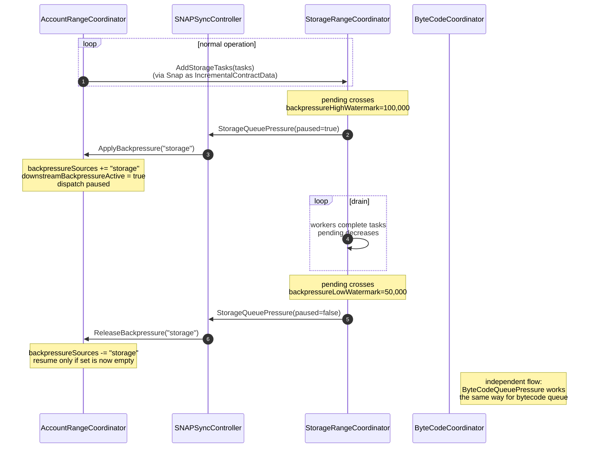

Key properties:

- **Workers in flight always complete.** Backpressure only gates the *next* dispatch decision; it never cancels work.
- **AND-semantics on release.** `backpressureSources` is a *set*; AccountRangeCoordinator resumes only when **all** downstream sources have released (`AccountRangeCoordinator.scala:105`: `downstreamBackpressureActive = backpressureSources.nonEmpty`).
- **Pivot refresh forcibly releases pressure** (`StorageRangeCoordinator.scala:821`) — after a pivot refresh, the queue is logically cleared (tasks re-targeted), so backpressure is cleared too. Re-engages if the new queue grows past 100k.

---

## 10. Peer Quality State Machine

Each SNAP-capable peer is tracked through a quality lifecycle. Demotions are strike-counted (PR #1237) and forgiven on pivot refresh (PR #1255).

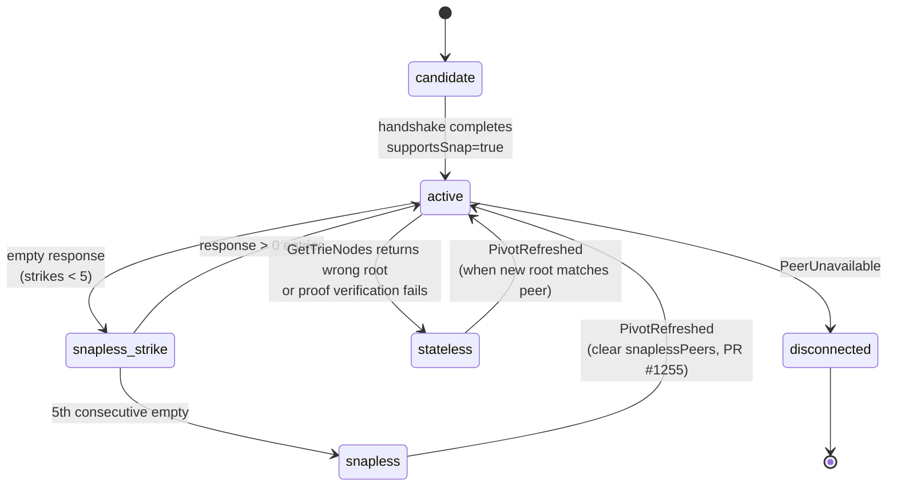

| Status | Meaning | Recovery |
|--------|---------|----------|
| `candidate` | Connected but capability unknown | Handshake completion |
| `active` | snap/1 capable, healthy | — |
| `snapless` | 5 consecutive empty responses on current root | Pivot refresh (PR #1255 fix; previously snaplessPeers was permanent within a sync) |
| `stateless` | Returned wrong root or invalid proof | Pivot refresh |
| `disconnected` | Network-level loss | New connection |

`activePeerCount` floors and dedup-by-`remoteAddress` (Bug 16 fix) prevent stale entries from inflating the count across reconnections.

---

## 11. State Healing and Validation

After `ByteCodeAndStorageSync` drains, the controller transitions to `StateHealing` (`SNAPSyncController.scala:2787`). Healing fills the small gaps left by the snapshot (e.g. nodes that were on the pivot at request time but advanced before the response).

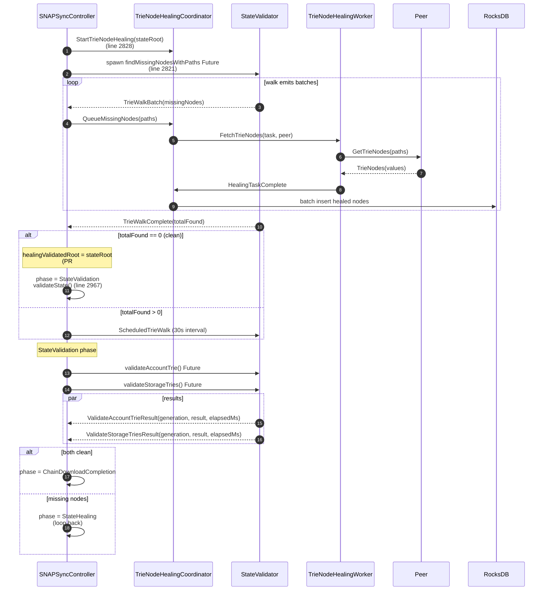

### 11.1 Healing-Validation Interleave

The trie walk runs as a Future on `snap-validation-dispatcher`. The healing coordinator processes its results in parallel — the walk doesn't block on healing completion, and healing doesn't block on walk completion. The terminal condition is a single `TrieWalkComplete(found=0)` event (a "second-pass clean" — the walk found zero missing nodes), which proves the trie is whole at the current root.

### 11.2 Validated-Root Cache (PR #1188)

`healingValidatedRoot` (`SNAPSyncController.scala` around line 2844) caches the root that the walk most recently confirmed clean. On entry to `StateValidation`, if the current root still matches, validation is skipped — the walk has already proven completeness. The cache is naturally invalidated on pivot refresh (root changes).

### 11.3 Async Result Staleness Guards

Both `ValidateAccountTrieResult` and `ValidateStorageTriesResult` carry a `generation: Long` counter (`SNAPSyncController.scala`). The controller bumps the generation on pivot refresh; stale Future results from an old generation are dropped. This prevents post-refresh false positives from in-flight validations.

### 11.4 Healing Stagnation

If two consecutive 2-minute walk cycles return zero healed nodes *without* reaching the `found=0` terminal state (i.e. peers consistently fail to serve `GetTrieNodes`), the coordinator signals `HealingStagnated(healed, pending)` after the 5-minute `healingStagnationTimeoutMs` (`TrieNodeHealingCoordinator.scala:60`). The controller forces a pivot refresh; if that doesn't resolve, it counts as a critical failure toward `max-snap-sync-failures`.

---

## 12. Persistence & Crash Recovery

Fukuii preserves enough progress that a restart mid-sync does not re-download work already complete.

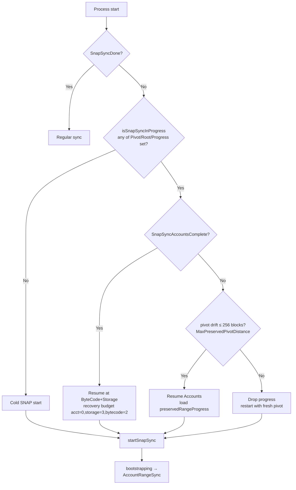

| State on restart | Recovery action |
|------------------|-----------------|
| `SnapSyncDone = true` | Skip SNAP; start regular sync |
| `SnapSyncAccountsComplete = true` | Restart at bytecode+storage phase; stream temp files |
| Progress present, drift ≤ 256 blocks | Restart at account phase with `preservedRangeProgress` |
| Progress present, drift > 256 blocks | Discard progress; restart from new pivot |
| No SNAP keys set | Cold start |

Range progress preservation is implemented via `AccountRangeProgress(progress: Map[ByteString, ByteString])` (Messages.scala) — the coordinator sends current `next` cursors per range to the controller, which persists them. On restart the controller passes them back to the coordinator as the `resumeProgress` Props argument.

---

## 13. Fallback to Fast Sync

When SNAP cannot make progress, the controller transitions to fast sync rather than spinning forever. Triggers:

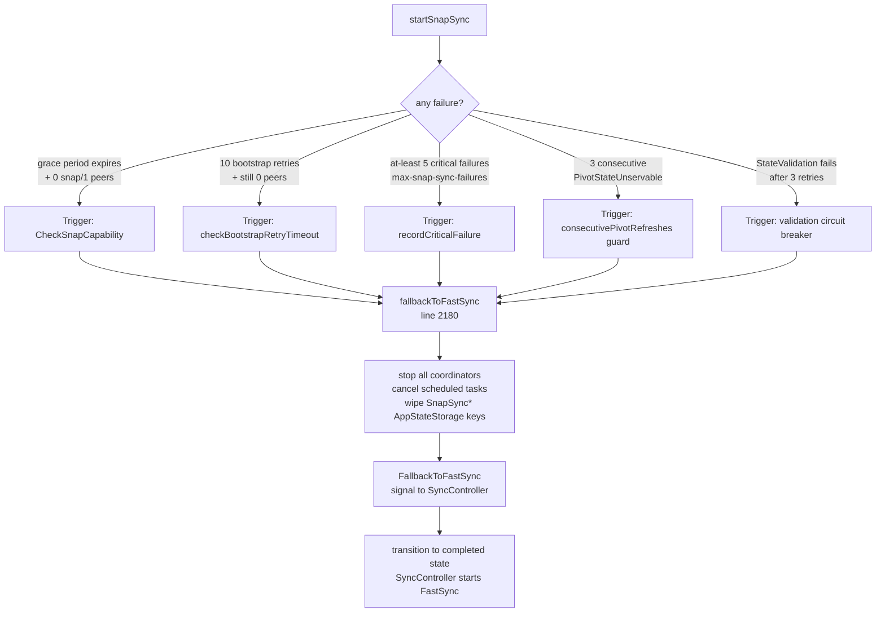

`fallbackToFastSync()` (`SNAPSyncController.scala:2180`) is idempotent and synchronously stops children before signalling — there's no race window where the controller transitions to `completed` while a coordinator continues writing.

Trigger details:

- **Grace period:** `snap-capability-grace-period = 30 seconds` (`sync.conf:115`). After bootstrap completes, if no connected peer has advertised `snap/1`, fall back. Keeps SNAP startup fast on networks (Mordor) where peers don't support snap.
- **Bootstrap retry timeout:** Exponential backoff 2s→4s→…→60s cap. After 10 retries with no peers, give up.
- **Critical failures:** Counted by `recordCriticalFailure()`. Includes circuit-breaker trips, state validation failures, repeated healing stagnation. `max-snap-sync-failures = 5` (`sync.conf:111`).
- **Consecutive pivot refreshes:** `MaxConsecutivePivotRefreshes = 3`. Increment on `PivotStateUnservable`; reset on actual account progress.

---

## 14. Configuration Reference

All keys live under `fukuii.sync.snap-sync.*`. Defaults in `src/main/resources/conf/base/sync.conf`. Override via `-Dfukuii.sync.snap-sync.<key>=<value>`.

### 14.1 Bootstrap & pivot

| Key | Default | sync.conf:line | Purpose |
|-----|---------|----------------|---------|
| `enabled` | `true` | 16 | Master enable |
| `pivot-block-offset` | 64 | 35 | Distance behind chain head for pivot (geth `fsMinFullBlocks`) |
| `snap-capability-grace-period` | 30 s | 115 | Wait for snap/1 peers before fallback |

### 14.2 Account download

| Key | Default | sync.conf:line | Purpose |
|-----|---------|----------------|---------|
| `account-concurrency` | 16 | 39 | Parallel account range tasks |
| `account-initial-response-bytes` | 524 288 | 138 | Initial size hint for `GetAccountRange` |
| `account-min-response-bytes` | 102 400 | 141 | Floor for adaptive ratchet-down |
| `account-trie-flush-threshold` | 50 000 | 134 | Nodes before RocksDB flush (≈ 20 MB heap) |
| `account-stagnation-timeout` | 60 s | 123 | Trigger pivot refresh if no completion (PR #1257; was 180s) |
| `use-stack-trie` | `true` | 27 | Enable streaming `StackTrie` |

### 14.3 Storage download

| Key | Default | sync.conf:line | Purpose |
|-----|---------|----------------|---------|
| `storage-concurrency` | 16 | 43 | Parallel storage range workers |
| `storage-batch-size` | 128 | 51 | Accounts per `GetStorageRanges` request |
| `storage-initial-response-bytes` | 1 048 576 | 56 | Initial size hint |
| `storage-min-response-bytes` | 131 072 | 59 | Floor |
| `max-concurrent-storage-accounts` | 256 | 66 | Cap on live `SnapHashTrie` instances (≈ 2 GiB heap ceiling) |
| `deferred-merkleization` | `false` | 79 | **Production must be false.** True causes GC death spiral on mainnet. |

### 14.4 Healing

| Key | Default | sync.conf:line | Purpose |
|-----|---------|----------------|---------|
| `healing-batch-size` | 128 | 84 | Paths per `GetTrieNodes` request |
| `healing-concurrency` | 16 | 88 | Parallel healing workers |
| `healing-max-inflight-per-peer` | 1 | 94 | Serialize healing per peer (geth/Besu aligned) |
| `state-validation-enabled` | `true` | 99 | Walk trie to detect missing nodes before transition |

### 14.5 Reliability

| Key | Default | sync.conf:line | Purpose |
|-----|---------|----------------|---------|
| `max-retries` | 3 | 103 | Per-request retry cap |
| `timeout` | 30 s | 107 | Per-request timeout |
| `max-snap-sync-failures` | 5 | 111 | Critical-failure threshold for fallback |
| `max-inflight-per-peer` | 5 | 128 | Per-peer pipelining cap (account+storage; bytecode already 5) |

### 14.6 Chain download (parallel with SNAP)

| Key | Default | sync.conf:line | Purpose |
|-----|---------|----------------|---------|
| `chain-download-enabled` | `true` | 145 | Overlap chain download with state download |
| `chain-download-max-concurrent-requests` | 2 | 149 | Conservative during SNAP (don't starve peers) |
| `chain-download-boosted-concurrent-requests` | 16 | 153 | After SNAP completes |
| `chain-backfill-concurrent-requests` | 2 | 157 | Historical backfill once regular sync owns peers |

---

## 15. Recent Changes (May 2026)

For quick orientation against the older docs, here is what's new in this architecture relative to ADR-SNAP-002 (2025-11-24):

**Memory model (entirely new since ADR-SNAP-002):**
- PR #1266 — `StackTrie` default for accounts (eliminated multi-GiB pivot trie + multi-minute flush)
- PR #1273 — Per-account streaming `SnapHashTrie` for storage (caps heap at 256 × 8 MiB = 2 GiB)

**Pivot / post-merge (new):**
- PR #1259 — CL-anchored pivot refresh; `clPivotHint` flow; `pivotPassesFreshnessFloor` guard
- PR #1260 — PoW chain weight from wire TD; backfill abort on missing parent weight; P2P lifecycle correctness
- PR #1236 / #1258 — Same-root pivot refresh is a no-op (preserves all progress)
- PR #1222 — Pivot readiness probe before notifying coordinators

**Peer management:**
- PR #1255 — Clear `snaplessPeers` on `PivotRefreshed` (was: indefinite account stall on small peer pools)
- PR #1256 — Strike threshold 3 → 5 for both account and storage empty responses
- PR #1237 — Strike-counted snapless+stateless peer demotion (was one-shot)

**Backpressure:**
- PR #1232 — `StorageQueuePressure` / `ByteCodeQueuePressure` AND-semantics
- PR #1241 — Release queue backpressure on pivot refresh (deadlock fix)

**Healing / validation:**
- PR #1188 — `healingValidatedRoot` cache (skip validation when walk confirms clean)

**Tuning:**
- PR #1257 — `account-stagnation-timeout` 180 s → 60 s
- PR #1252 — Storage in-flight budget bumped to 2 during `AccountRangeSync` (was 0)

**Cleanup:**
- PR #1280 — Removed stale TODO/planning docs

---

## 16. See Also

- `docs/adr/protocols/ADR-SNAP-001-protocol-infrastructure.md` — snap/1 wire spec (capability negotiation, all 8 message types, RLP encoding)
- `docs/architecture/SNAP_SYNC_BYTECODE_IMPLEMENTATION.md` — bytecode task creation, download, verification
- `docs/architecture/SNAP_SYNC_STATE_VALIDATION.md` — trie traversal details, missing node detection
- `docs/architecture/SNAP_SYNC_ERROR_HANDLING.md` — retry logic, exponential backoff, circuit breaker
- `docs/operations/monitoring-snap-sync.md` — Kamon metrics, Grafana dashboard layout
- `docs/runbooks/snap-sync-user-guide.md`, `snap-sync-performance-tuning.md`, `snap-sync-faq.md`
