# Fukuii Application Architecture Overview

**Document Status:** Living Document  
**Last Updated:** 2025-10-25  
**Version:** 1.0

## Table of Contents

1. [Introduction](#introduction)
2. [System Overview](#system-overview)
3. [High-Level Architecture](#high-level-architecture)
4. [Major Systems](#major-systems)
5. [Subsystems](#subsystems)
6. [Data Flow](#data-flow)
7. [Technology Stack](#technology-stack)
8. [Architectural Decision Log](#architectural-decision-log)

## Introduction

Fukuii is an Ethereum Classic (ETC) client written in Scala. It is a continuation and re-branding of the Mantis client originally developed by Input Output (HK). Fukuii is maintained by Chippr Robotics LLC with the aim of modernizing the codebase, ensuring long-term support, and providing a robust, scalable implementation of the Ethereum Classic protocol.

This document provides a comprehensive overview of Fukuii's current architecture, identifying major systems, subsystems, and their interactions. It serves as a reference for developers, architects, and contributors to understand the system's design and structure.

## System Overview

Fukuii is a full-featured Ethereum Classic node implementation that:

- **Maintains the blockchain**: Stores and validates blocks, headers, and transaction data
- **Executes transactions**: Runs the Ethereum Virtual Machine (EVM) to execute smart contracts
- **Synchronizes with the network**: Downloads blocks from peers and stays synchronized with the blockchain
- **Mines blocks**: Supports Proof of Work (PoW) mining using Ethash algorithm
- **Provides JSON-RPC API**: Exposes standard Ethereum JSON-RPC endpoints for client applications
- **Manages peer connections**: Discovers, connects to, and communicates with other nodes on the network

## High-Level Architecture

Fukuii follows a modular, layered architecture built on the Actor model using Akka. The system can be visualized as follows:

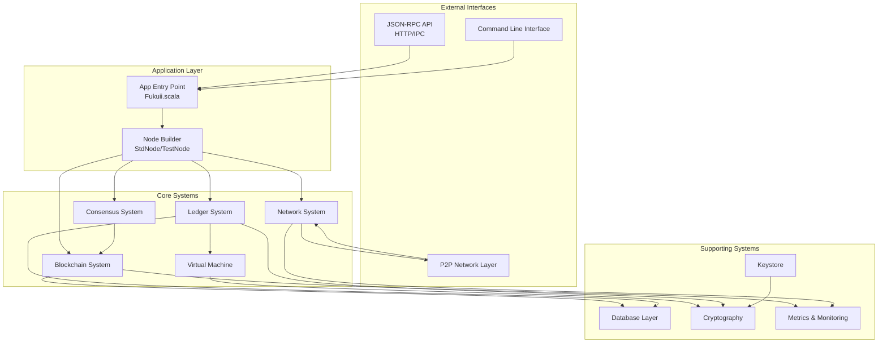

## Major Systems

### 1. Application Layer

**Location:** `com.chipprbots.ethereum.App`, `com.chipprbots.ethereum.Fukuii`

The Application Layer serves as the entry point for Fukuii. It handles:
- Command-line argument parsing
- Mode selection (standard node, test node, CLI tools, faucet, etc.)
- System initialization and startup
- Lifecycle management

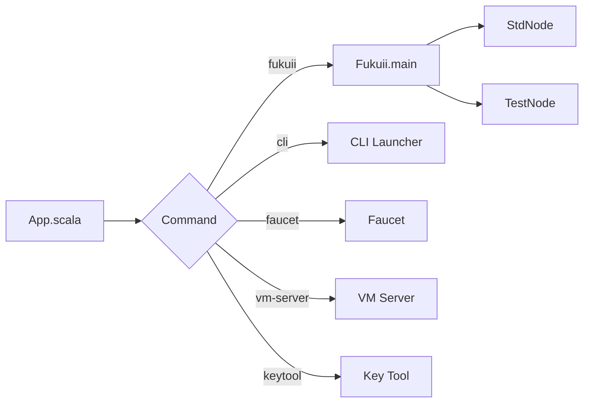

**Key Components:**
- `App.scala`: Main entry point with command routing
- `Fukuii.scala`: Core node initialization
- `BootstrapDownload.scala`: Bootstrap data loader

### 2. Node Builder System

**Location:** `com.chipprbots.ethereum.nodebuilder`

The Node Builder system is responsible for constructing and configuring all components of a Fukuii node. It uses a builder pattern with trait composition to assemble the various subsystems.

**Key Components:**
- `NodeBuilder.scala`: Core builder with configuration traits
- `StdNode.scala`: Standard production node implementation
- `TestNode.scala`: Test mode node for development

**Startup Sequence:**
1. Initialize metrics client
2. Fix/validate database
3. Load genesis data
4. Run database consistency check
5. Start peer manager
6. Start server (P2P listener)
7. Start sync controller
8. Start mining (if enabled)
9. Start peer discovery
10. Start JSON-RPC servers (HTTP/IPC)

### 3. Blockchain System

**Location:** `com.chipprbots.ethereum.blockchain`

The Blockchain system manages the chain of blocks, including storage, validation, and synchronization.

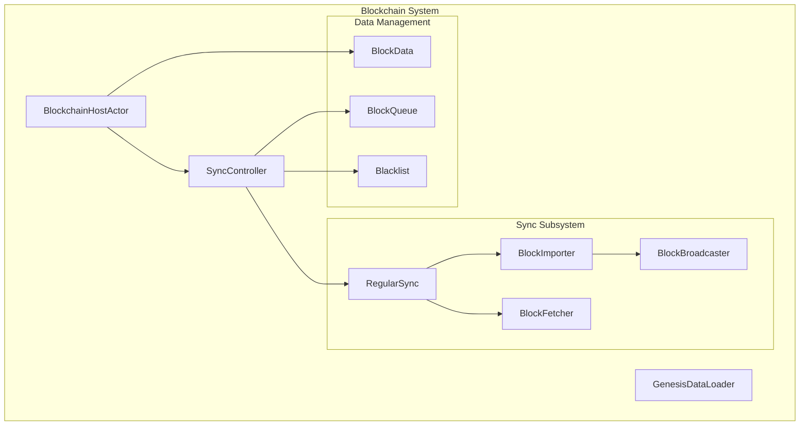

**Key Subsystems:**
- **Sync Subsystem**: Synchronizes blockchain state with peers
  - Regular sync for ongoing synchronization
  - Fast sync for initial blockchain download
  - Block import and validation
  - Block broadcasting to peers
  
- **Data Management**: Handles block storage and retrieval
  - Block headers, bodies, and receipts
  - Block number to hash mapping
  - Chain weight tracking

### 4. Consensus System

**Location:** `com.chipprbots.ethereum.consensus`

The Consensus system implements the rules for achieving agreement on the blockchain state.

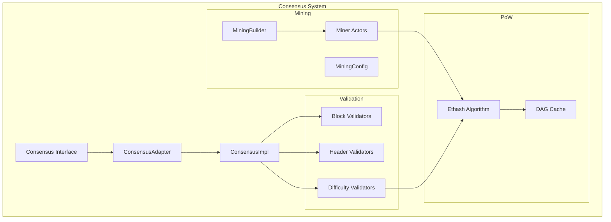

**Key Components:**
- **Consensus Interface**: Defines consensus operations
- **Validators**: Validate blocks, headers, and difficulty
- **Mining**: Proof-of-Work mining implementation
  - Ethash algorithm support
  - DAG generation and caching
  - Block generation and sealing
- **Difficulty Calculation**: Computes block difficulty based on network rules

### 5. Network System

**Location:** `com.chipprbots.ethereum.network`

The Network system handles all peer-to-peer communication, discovery, and protocol implementation.

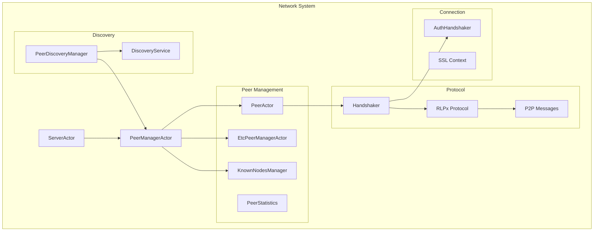

**Key Subsystems:**
- **Peer Management**: Manages connections to other nodes
  - Connection establishment and maintenance
  - Peer blacklisting
  - Peer statistics and scoring
  
- **Discovery**: Finds and connects to peers
  - UDP-based discovery protocol
  - Known nodes persistence
  - Bootstrap nodes
  
- **Protocol Layer**: Implements Ethereum wire protocol
  - RLPx encryption and framing
  - ETH protocol messages
  - Handshaking and capability negotiation

### 6. Ledger System

**Location:** `com.chipprbots.ethereum.ledger`

The Ledger system manages state transitions and transaction execution.

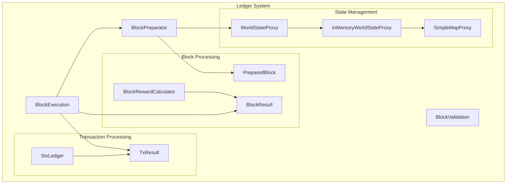

**Key Components:**
- **Block Preparator**: Prepares blocks for execution
- **Block Execution**: Executes transactions in blocks
- **World State Proxy**: Manages Ethereum world state
  - Account balances and nonces
  - Contract storage
  - Account code
- **Transaction Processing**: Executes individual transactions
- **Block Rewards**: Calculates mining rewards

### 7. Virtual Machine (VM)

**Location:** `com.chipprbots.ethereum.vm`

The VM system implements the Ethereum Virtual Machine for smart contract execution.

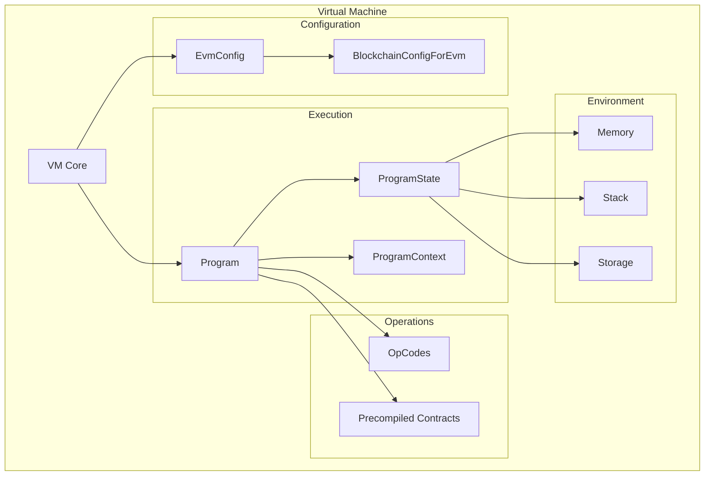

**Key Components:**
- **VM Core**: Main execution engine
- **OpCodes**: Implements all EVM opcodes
- **Program State**: Tracks execution state (stack, memory, storage)
- **Precompiled Contracts**: Native implementations of special contracts
- **EVM Config**: Configuration for different hard forks (Frontier, Homestead, Byzantium, Constantinople, Istanbul, Berlin, London, etc.)

### 8. JSON-RPC System

**Location:** `com.chipprbots.ethereum.jsonrpc`

The JSON-RPC system provides the standard Ethereum JSON-RPC API for external applications.

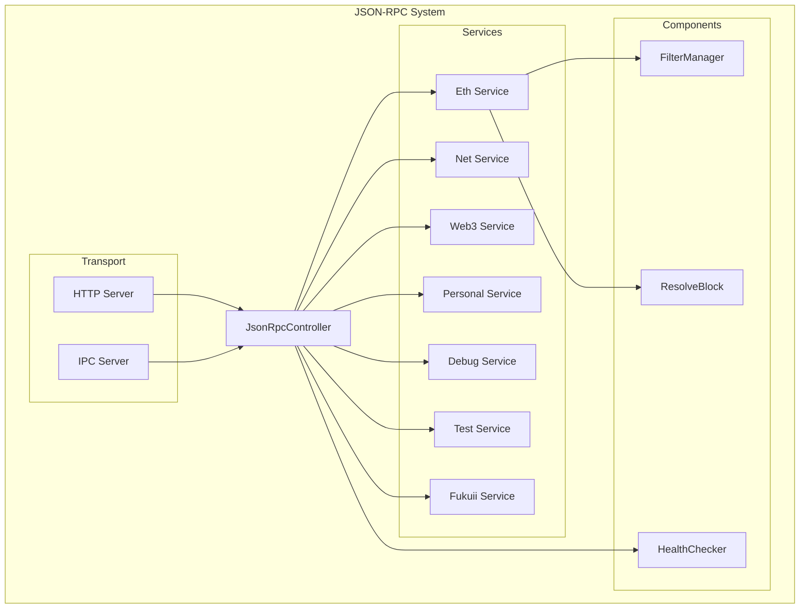

**Key Services:**
- **Eth Service**: Core Ethereum RPC methods
  - Block queries (eth_getBlockByNumber, eth_getBlockByHash)
  - Transaction submission (eth_sendRawTransaction)
  - State queries (eth_getBalance, eth_getCode, eth_call)
  - Mining methods (eth_getWork, eth_submitWork)
  
- **Personal Service**: Account management
- **Net Service**: Network information
- **Web3 Service**: Client version and utilities
- **Debug Service**: Debugging utilities
- **Test Service**: Testing utilities (test mode only)

### 9. Database System

**Location:** `com.chipprbots.ethereum.db`

The Database system provides persistent storage for blockchain data.

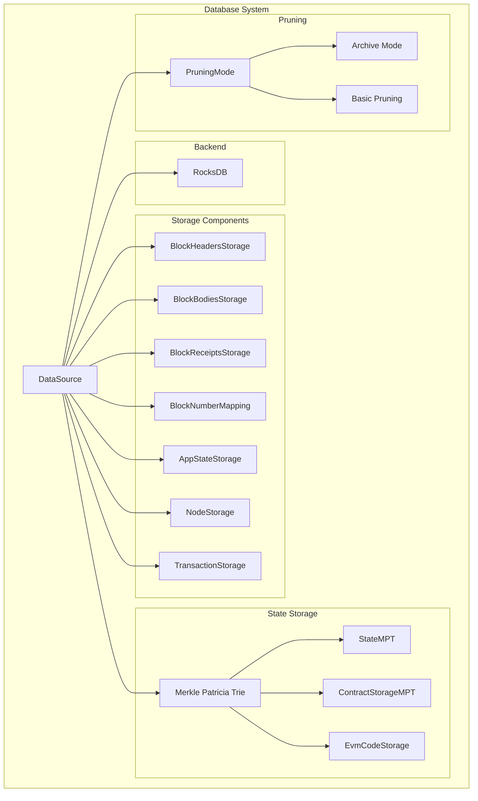

**Key Components:**
- **DataSource**: Abstraction over storage backend (RocksDB)
- **Block Storage**: Stores blocks, headers, bodies, receipts
- **State Storage**: Merkle Patricia Trie for world state
- **App State**: Stores best block, sync state
- **Pruning**: Configurable state pruning strategies

## Subsystems

### Transaction Management

**Location:** `com.chipprbots.ethereum.transactions`

- `PendingTransactionsManager`: Manages the transaction pool (mempool)
- `TransactionHistoryService`: Tracks transaction history

### Ommers Management

**Location:** `com.chipprbots.ethereum.ommers`

- `OmmersPool`: Manages uncle blocks (ommers) for inclusion in new blocks

### Cryptography

**Location:** `com.chipprbots.ethereum.crypto`

- ECDSA signature generation and verification
- Keccak-256 hashing
- Key generation and management
- Secure random number generation

### Keystore

**Location:** `com.chipprbots.ethereum.keystore`

- `KeyStore`: Manages encrypted private keys
- `KeyStoreImpl`: File-based keystore implementation
- Passphrase-based encryption

### RLP Encoding

**Location:** `com.chipprbots.ethereum.rlp`

- Recursive Length Prefix encoding/decoding
- Used throughout the system for serialization

### Merkle Patricia Trie

**Location:** `com.chipprbots.ethereum.mpt`

- Implementation of Ethereum's modified Merkle Patricia Trie
- Used for state storage and proof generation

### Metrics & Monitoring

**Location:** `com.chipprbots.ethereum.metrics`

- Kamon-based metrics collection
- Prometheus exposition
- Performance monitoring
- Health checks

### Health Check

**Location:** `com.chipprbots.ethereum.healthcheck`

- Node health monitoring
- Readiness and liveness probes
- Integration with JSON-RPC health endpoints

### CLI Tools

**Location:** `com.chipprbots.ethereum.cli`

- Private key generation
- Address utilities
- Development tools

### Faucet

**Location:** `com.chipprbots.ethereum.faucet`

- Test network faucet implementation
- Automated ETH distribution for testing

### External VM

**Location:** `com.chipprbots.ethereum.extvm`

- External VM server for testing
- VM conformance testing

### Fork ID

**Location:** `com.chipprbots.ethereum.forkid`

- EIP-2124 fork identifier implementation
- Network compatibility checks

### Domain Models

**Location:** `com.chipprbots.ethereum.domain`

Core domain objects used throughout the system:
- `Block`, `BlockHeader`, `BlockBody`
- `Transaction`, `SignedTransaction`
- `Account`, `Address`
- `Receipt`, `Log`
- `Blockchain`, `BlockchainConfig`

### Utilities

**Location:** `com.chipprbots.ethereum.utils`

- Configuration management
- Logging
- Byte utilities
- Numeric utilities
- Time utilities

## Data Flow

### Block Synchronization Flow

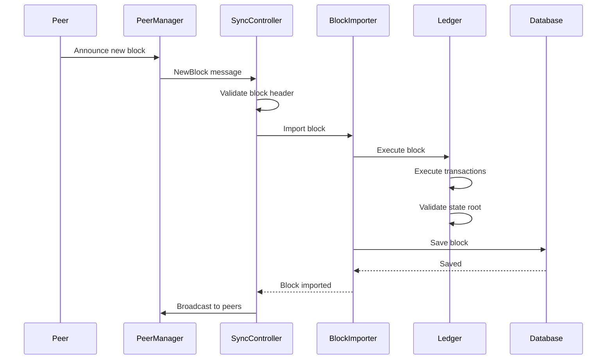

### Transaction Submission Flow

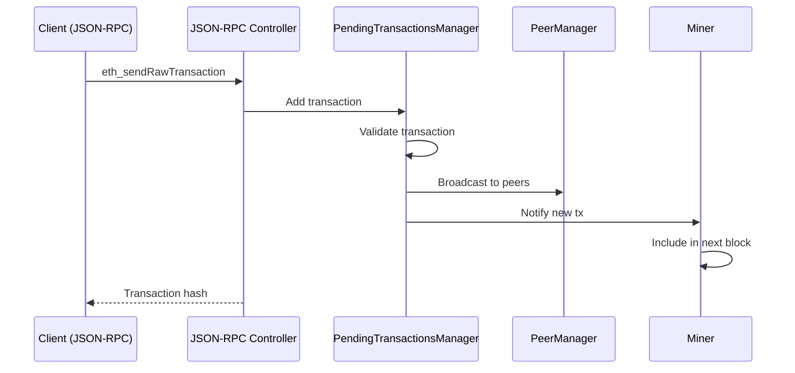

### Block Mining Flow

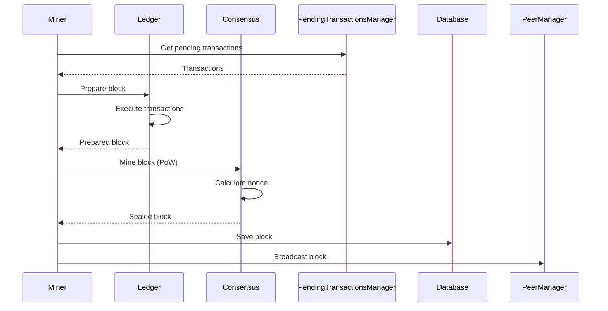

### Smart Contract Execution Flow

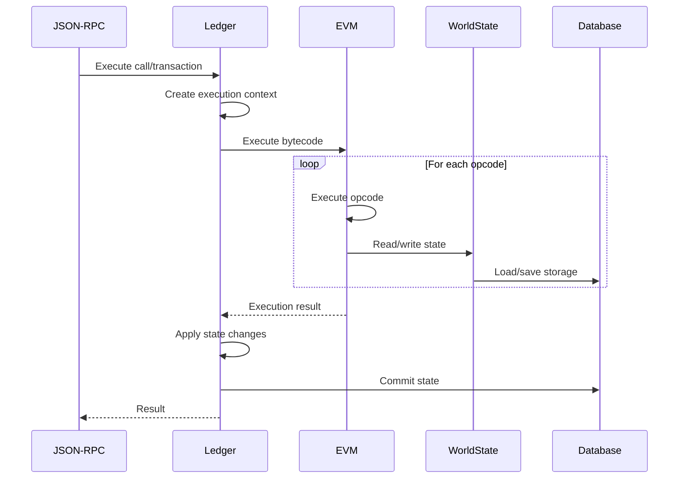

## Technology Stack

### Languages & Frameworks
- **Scala 3.3.4** (LTS): Primary programming language
- **Apache Pekko**: Actor-based concurrency framework (Scala 3 compatible fork of Akka)
- **Cats Effect 3**: Functional effect system
- **fs2**: Functional streaming library
- **Cats**: Functional programming library

### Storage
- **RocksDB**: Embedded key-value store for blockchain data

### Networking
- **Akka IO**: Low-level networking
- **UDP/TCP**: Network protocols

### Cryptography
- **Bouncy Castle**: Cryptographic primitives
- **Keccak**: Hash function

### Serialization
- **RLP**: Recursive Length Prefix encoding
- **JSON**: JSON-RPC serialization

### Monitoring & Metrics
- **Kamon**: Metrics collection
- **Prometheus**: Metrics exposition

### Testing
- **ScalaTest**: Unit and integration testing
- **ScalaCheck**: Property-based testing

### Build & Deployment
- **SBT**: Build tool
- **Docker**: Containerization
- **Nix**: Reproducible builds
- **GitHub Actions**: CI/CD

### Configuration
- **Typesafe Config (HOCON)**: Configuration management

## Architectural Decision Log

This section documents significant architectural decisions made during the development of Fukuii. Each entry should include the context, decision, and rationale.

**Note:** Detailed ADRs are maintained in the [`docs/adr/`](adr/) directory. This section provides summaries of key decisions.

### ADL-001: Continuation of Mantis as Fukuii

**Date:** 2024-10-24  
**Status:** Accepted  
**Context:** Mantis development by IOHK had slowed down, but the codebase was solid and well-architected.  
**Decision:** Fork Mantis and continue development as Fukuii under Chippr Robotics LLC.  
**Consequences:**
- Maintains compatibility with Ethereum Classic network
- Preserves years of development work
- Requires rebranding throughout codebase
- Enables independent development and modernization

### ADL-002: Actor-Based Architecture with Akka

**Date:** Historical (inherited from Mantis)  
**Status:** Accepted  
**Context:** Ethereum nodes require high concurrency and need to handle multiple simultaneous operations (network I/O, block processing, mining, RPC requests).  
**Decision:** Use Akka actor model for concurrency management.  
**Consequences:**
- Clear separation of concerns through actors
- Natural message-passing for async operations
- Built-in supervision and fault tolerance
- Learning curve for contributors unfamiliar with actors
- Some complexity in tracking message flows

### ADL-003: RocksDB as Primary Storage Backend

**Date:** Historical (inherited from Mantis)  
**Status:** Accepted  
**Context:** Need for high-performance, persistent key-value storage for blockchain data.  
**Decision:** Use RocksDB as the primary storage backend.  
**Consequences:**
- Excellent read/write performance
- Efficient storage with compression
- Well-tested in production blockchain applications
- Platform-specific native library dependency
- Limited to single-node deployment

### ADL-004: Scala as Implementation Language

**Date:** Historical (inherited from Mantis)  
**Status:** Accepted  
**Context:** Need for a language that supports functional programming, strong typing, and JVM interoperability.  
**Decision:** Implement Fukuii in Scala.  
**Consequences:**
- Strong type system catches errors at compile time
- Functional programming paradigms for safer code
- Excellent concurrency support with Akka
- JVM ecosystem and tooling
- Slower compilation times compared to some languages
- Smaller contributor pool than mainstream languages

### ADL-005: Modular Package Structure

**Date:** Historical (inherited from Mantis)  
**Status:** Accepted  
**Context:** Large codebase requires clear organization and separation of concerns.  
**Decision:** Organize code into distinct packages by functionality (blockchain, consensus, network, ledger, vm, etc.).  
**Consequences:**
- Clear boundaries between subsystems
- Easier to understand and navigate codebase
- Enables parallel development
- Reduces coupling between modules
- Requires discipline to maintain boundaries

### VM-002: Implementation of EIP-3529 (Reduction in Refunds)

**Date:** 2024-10-25  
**Status:** Accepted  
**Context:** EIP-3529 changes gas refund mechanics to reduce state bloat and prevent gas refund gaming.  
**Decision:** Implement EIP-3529 as part of the Mystique hard fork with reduced `R_sclear` (4,800 gas), zero `R_selfdestruct`, and reduced maximum refund quotient (gasUsed / 5).  
**Consequences:**
- Reduced state bloat from "gas tokens"
- More accurate gas economics
- Breaking change for contracts relying on refunds
- Improved network security

**See:** [Full VM-002 documentation](../adr/vm/VM-002-eip-3529-implementation.md)

---

## Future Enhancements

Areas identified for potential architectural improvements:

1. **Observability**: Enhanced metrics, tracing, and logging
2. **Performance**: Profiling and optimization of critical paths
3. **Modularity**: Further decoupling of subsystems
4. **Testing**: Increased test coverage and integration tests
5. **Documentation**: Expanded API and developer documentation
6. **Scalability**: Optimizations for large-scale deployments

---

**Note:** This is a living document. As architectural decisions are made or the system evolves, this document should be updated to reflect the current state of the system. Contributors should add new ADL entries for significant architectural changes.
