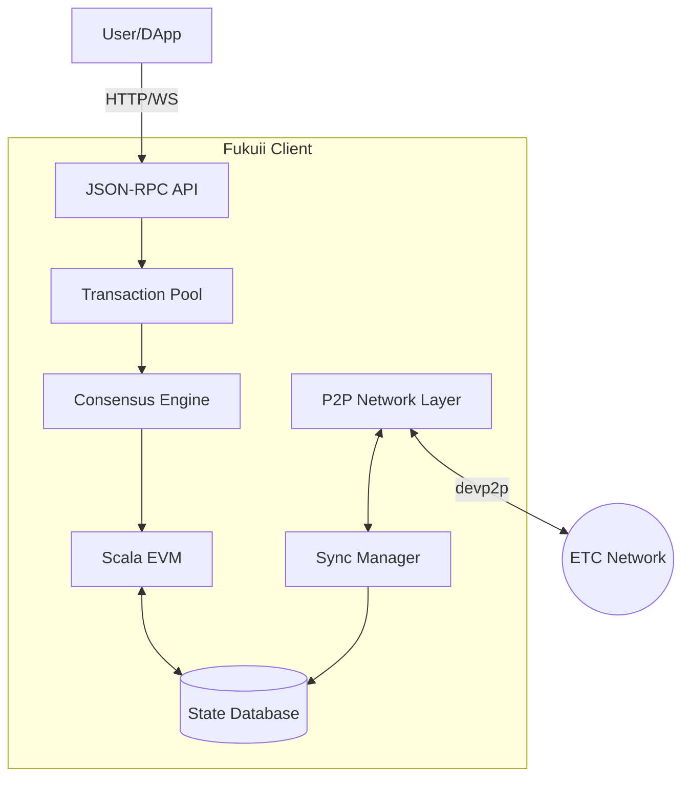

# For Developers

This section contains guides for contributing to Fukuii, understanding its architecture, and using its APIs.

## Start Here

1. **[Contributing Guide](../development/contributing.md)** — How to contribute code
2. **[Architecture Overview](../architecture/architecture-overview.md)** — Understand the system design
3. **[Repository Structure](../development/REPOSITORY_STRUCTURE.md)** — Navigate the codebase

## Quick Setup

### Prerequisites

- **JDK 21** — Required for building and running
- **sbt 1.10.7+** — Scala build tool
- **Git** — Version control

### Clone and Build

```bash
# Clone the repository
git clone https://github.com/chippr-robotics/fukuii.git
cd fukuii

# Update submodules
git submodule update --init --recursive

# Compile
sbt compile

# Run tests
sbt testAll
```

### GitHub Codespaces

For the fastest setup, use GitHub Codespaces:

1. Navigate to the [Fukuii repository](https://github.com/chippr-robotics/fukuii)
2. Click **Code** → **Codespaces** → **Create codespace on develop**
3. Wait for the environment to initialize

## Architecture

<div class="grid cards" markdown>

-   :classical_building: **Architecture Overview**

    ---

    High-level system design and component interaction.

    [:octicons-arrow-right-24: Overview](../architecture/architecture-overview.md)

-   :bar_chart: **Architecture Diagrams**

    ---

    C4 diagrams and visual representations.

    [:octicons-arrow-right-24: Diagrams](../architecture/ARCHITECTURE_DIAGRAMS.md)

-   :desktop_computer: **Console UI**

    ---

    Console interface design and implementation.

    [:octicons-arrow-right-24: Console UI](../architecture/console-ui.md)

</div>

### Key Components



## Development Workflow

### Code Quality

```bash
# Format code (before committing)
sbt formatAll

# Check formatting and style (runs in CI)
sbt formatCheck

# Run static analysis
sbt runScapegoat

# Full PR preparation
sbt pp
```

### Testing

```bash
# Run all tests
sbt testAll

# Run tests with coverage
sbt testCoverage

# Run specific module tests
sbt bytes/test
sbt crypto/test
sbt rlp/test

# Run integration tests
sbt "IntegrationTest / test"
```

### Test Tiers

| Tier | Command | Duration | Use Case |
|------|---------|----------|----------|
| Essential | `sbt testEssential` | < 5 min | Quick validation |
| Standard | `sbt testCoverage` | < 30 min | PR checks |
| Comprehensive | `sbt testComprehensive` | < 3 hours | Nightly builds |

## API Development

### JSON-RPC API

Fukuii implements the standard Ethereum JSON-RPC interface:

- **[API Reference](../api/JSON_RPC_API_REFERENCE.md)** — 77 documented methods
- **[Coverage Analysis](../api/JSON_RPC_COVERAGE_ANALYSIS.md)** — Gap analysis vs specification
- **[Insomnia Workspace](../api/INSOMNIA_WORKSPACE_GUIDE.md)** — API testing collection

### Example API Call

```bash
curl -X POST http://localhost:8546 \
  -H "Content-Type: application/json" \
  -d '{"jsonrpc":"2.0","method":"eth_blockNumber","params":[],"id":1}'
```

## Architecture Decision Records (ADRs)

ADRs document significant architectural decisions:

| Category | Description |
|----------|-------------|
| [Infrastructure](../adr/infrastructure/) | Platform, runtime, and build decisions |
| [Consensus](../adr/consensus/) | Protocol and networking decisions |
| [VM](../adr/vm/) | EVM and EIP implementations |
| [Testing](../adr/testing/) | Testing strategy and frameworks |
| [Operations](../adr/operations/) | Operational tooling decisions |

### Recent ADRs

- **INF-001**: Scala 3 Migration
- **CON-002**: Bootstrap Checkpoints
- **INF-004**: Actor IO Error Handling

## Code Organization

### Package Structure

All code uses the package prefix: `com.chipprbots.ethereum`

### Module Overview

| Module | Purpose |
|--------|---------|
| `bytes` | Byte array utilities |
| `crypto` | Cryptographic operations |
| `rlp` | RLP encoding/decoding |
| `scalanet` | P2P networking |
| `src` | Main Fukuii application |
| `ets` | Ethereum Test Suite |

## Contributing

### Before Submitting a PR

- [ ] Run `sbt formatCheck` — Code formatting
- [ ] Run `sbt compile-all` — Compilation
- [ ] Run `sbt testAll` — All tests pass
- [ ] Update documentation if needed

### CI Pipeline

The CI automatically checks:

- ✅ Code compilation
- ✅ Formatting (scalafmt + scalafix)
- ✅ Static analysis (Scapegoat)
- ✅ Test suite with coverage
- ✅ Docker builds

## Related Documentation

- [Specifications](../specifications/README.md) — Technical specifications
- [Testing Documentation](../testing/README.md) — Test strategy and guides
- [Troubleshooting](../troubleshooting/README.md) — Common development issues
