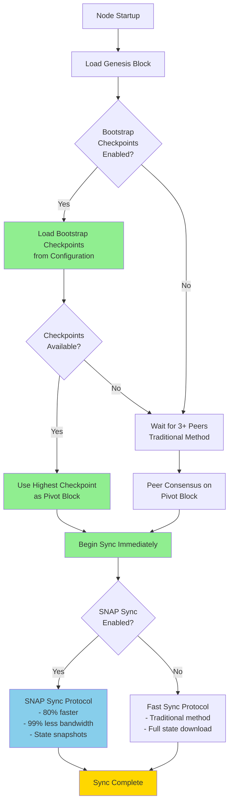
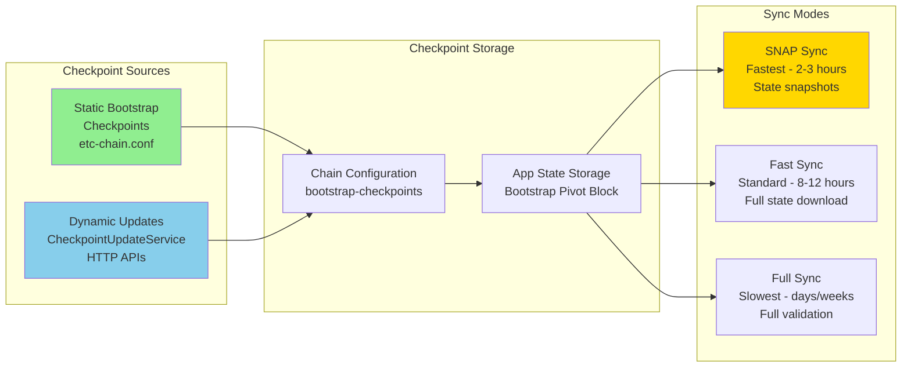

# Checkpoint Service for Rapid Sync

This guide explains how to run and use the checkpoint service in Fukuii to enable rapid blockchain synchronization. The checkpoint service provides trusted block references that eliminate peer wait times and dramatically accelerate initial node setup.

## Overview: Rapid Sync Architecture

**Rapid sync** refers to Fukuii's fast initial synchronization capability that combines three complementary technologies:

1. **Bootstrap Checkpoints** - Trusted block references that bypass peer discovery delays
2. **SNAP Sync** - High-performance state synchronization protocol (80% faster than traditional sync)
3. **Checkpoint Update Service** - Dynamic checkpoint management for production environments



### Time Savings with Rapid Sync

| Method | Time to Start Syncing | Total Sync Time (ETC Mainnet) |
|--------|----------------------|-------------------------------|
| **Traditional** (No checkpoints) | 2-10 minutes<br/>(peer wait) | ~8-12 hours<br/>(fast sync) |
| **Bootstrap Checkpoints Only** | **Immediate**<br/>(no wait) | ~8-12 hours<br/>(fast sync) |
| **Rapid Sync**<br/>(Checkpoints + SNAP) | **Immediate**<br/>(no wait) | **~2-3 hours**<br/>(SNAP sync) |

**Key Benefit**: Rapid sync eliminates the peer discovery bottleneck and reduces total sync time by up to **75%**.

## What is the Checkpoint Service?

The checkpoint service provides two complementary checkpoint management systems:

1. **Static Bootstrap Checkpoints** (`BootstrapCheckpointLoader`) - For reliable initial sync
2. **Dynamic Checkpoint Updates** (`CheckpointUpdateService`) - For ongoing checkpoint management

Both systems solve the **initial sync bootstrap problem** where nodes traditionally wait for peer consensus before beginning blockchain synchronization. By providing trusted block references at known heights (checkpoints), nodes can begin syncing immediately without the peer discovery delay.

### Purpose and Use Cases

**Primary Purpose: Faster Initial Sync**
- **Problem**: Traditional nodes wait for 3+ peers to reach consensus on a pivot block before syncing, causing delays during first startup
- **Solution**: Pre-verified checkpoints allow immediate sync start, bypassing the peer wait requirement
- **Benefit**: Reduces initial sync time from minutes/hours to seconds for node bootstrapping

**Use Cases by Network Type:**

1. **Public Networks (ETC Mainnet, Mordor)**
   - Faster onboarding for new node operators
   - Improved reliability in regions with poor network connectivity
   - Critical for nodes behind restrictive firewalls with limited peer access
   - Reduces bootstrap time during network disruptions or low peer availability

2. **Private/Enterprise Networks** ⭐
   - **Essential for private blockchain deployments**: Private networks often have limited peers (3-10 nodes), making peer-based pivot selection unreliable
   - **Consortium networks**: Pre-defined checkpoints ensure all consortium members sync from agreed-upon trusted blocks
   - **Development/Testing environments**: Rapidly deploy test networks without peer discovery delays
   - **Air-gapped deployments**: Nodes can sync without external peer connectivity by using pre-loaded checkpoints
   - **Permissioned networks**: Centrally managed checkpoint updates ensure all nodes maintain consensus on chain history

3. **Disaster Recovery**
   - Quick recovery from database corruption by syncing from verified checkpoints
   - Faster node replacement in production environments
   - Simplified backup/restore procedures

### How It Works

The checkpoint service operates in two modes:

**Mode 1: Static Checkpoints (BootstrapCheckpointLoader)**
- Checkpoints are hardcoded in chain configuration files (`etc-chain.conf`, `mordor-chain.conf`)
- Loaded once at node startup if database is empty (genesis-only state)
- Used as trusted reference points during initial sync
- Documented in [CON-002: Bootstrap Checkpoints ADR](../adr/consensus/CON-002-bootstrap-checkpoints.md)

**Mode 2: Dynamic Updates (CheckpointUpdateService)** ⭐ *This document*
- Fetches checkpoint data from HTTP endpoints
- Verifies checkpoints across multiple sources using quorum consensus
- Enables automated checkpoint updates for production deployments
- **Particularly useful for private networks** where operators maintain their own checkpoint servers

## Overview

The checkpoint update service fetches trusted checkpoint data from configured sources and verifies them using quorum consensus. This is useful for:

- **Private Networks**: Maintaining operator-controlled checkpoint sources for consortium or enterprise deployments
- **Automated Updates**: Keeping checkpoint configurations up-to-date without manual intervention
- **Multi-Source Verification**: Verifying checkpoint data from multiple independent sources for security
- **Production Deployments**: Automating checkpoint management across node fleets

## Checkpoint Service Architecture

### Integration with Sync Modes

Fukuii supports multiple synchronization modes that work together with checkpoints:



**How Checkpoints Enable Rapid Sync:**

1. **Bootstrap Phase** (Node Startup)
   - `BootstrapCheckpointLoader` reads checkpoints from chain configuration
   - Highest checkpoint stored as "bootstrap pivot block" in app state
   - Node reports this block number in Status messages to peers

2. **Sync Selection Phase**
   - If SNAP sync enabled: Uses checkpoint as starting point for state download
   - If fast sync enabled: Uses checkpoint to skip peer consensus phase
   - Sync begins immediately without waiting for 3+ peers

3. **Synchronization Phase**
   - SNAP sync downloads account/storage ranges from checkpoint forward
   - Fast sync downloads full state from checkpoint forward
   - Traditional peer wait (2-10 minutes) eliminated entirely

4. **Update Phase** (Optional - Production Only)
   - `CheckpointUpdateService` periodically fetches new checkpoints
   - Multi-source verification ensures checkpoint accuracy
   - New checkpoints available for future node restarts

### Checkpoint Update Service Pattern

The dynamic checkpoint service implements a multi-source verification pattern:

```
┌─────────────────────────────────────────────────┐
│     CheckpointUpdateService                     │
│                                                 │
│  1. Fetch from multiple sources concurrently   │
│  2. Parse JSON responses                       │
│  3. Verify with quorum consensus               │
│  4. Return verified checkpoints                │
└─────────────────────────────────────────────────┘
           │
           ├──> Source 1: Official ETC
           ├──> Source 2: BlockScout
           └──> Source 3: Expedition
```

## JSON Format

Checkpoint sources must return JSON in the following format:

```json
{
  "network": "etc-mainnet",
  "checkpoints": [
    {
      "blockNumber": 19250000,
      "blockHash": "0x1234567890abcdef1234567890abcdef1234567890abcdef1234567890abcdef"
    },
    {
      "blockNumber": 14525000,
      "blockHash": "0xabcdef1234567890abcdef1234567890abcdef1234567890abcdef1234567890"
    }
  ]
}
```

### Field Descriptions

- **network**: Network identifier (e.g., "etc-mainnet", "mordor")
- **checkpoints**: Array of checkpoint objects
- **blockNumber**: Block height as a number
- **blockHash**: 32-byte block hash as hex string (with or without "0x" prefix)

## Rapid Sync in Practice

This section demonstrates how checkpoints enable rapid sync in real-world scenarios.

### Scenario 1: Fresh Node Startup with Rapid Sync

**Without Checkpoints (Traditional Method):**
```bash
$ ./bin/fukuii etc --no-bootstrap-checkpoints

[INFO] Starting Fukuii node for ETC mainnet
[INFO] Database is empty, beginning initial sync
[INFO] Waiting for peers... (0/3 required)
[INFO] Waiting for peers... (1/3 required)
[INFO] Waiting for peers... (2/3 required)
[INFO] Waiting for peers... (3/3 required)
[WAIT] 8 minutes elapsed...
[INFO] Querying peers for pivot block consensus
[INFO] Pivot block selected: 19250000
[INFO] Beginning fast sync from block 19250000
[INFO] ETA: 8-12 hours
```

**With Checkpoints + SNAP Sync (Rapid Sync):**
```bash
$ ./bin/fukuii etc

[INFO] Starting Fukuii node for ETC mainnet
[INFO] Database is empty, loading bootstrap checkpoints
[INFO] Bootstrap checkpoints loaded: 4 checkpoints available
[INFO] Highest checkpoint: block 19250000
[INFO] Stored as bootstrap pivot block for immediate sync
[INFO] Beginning SNAP sync from block 19250000 (no peer wait required)
[INFO] SNAP sync progress: Downloading account ranges...
[INFO] Account sync: 25% complete (128 ranges downloaded)
[INFO] Account sync: 50% complete (256 ranges downloaded)
[INFO] Account sync: 75% complete (384 ranges downloaded)
[INFO] Account sync: 100% complete (512 ranges downloaded)
[INFO] Storage sync: Processing contract storage...
[INFO] State healing: Verifying trie completeness...
[INFO] SNAP sync complete! Transitioning to regular sync
[INFO] ETA: 2-3 hours (75% faster than traditional sync)
```

**Time Comparison:**
- **Peer wait eliminated**: 8 minutes → 0 seconds
- **Total sync time**: 8-12 hours → 2-3 hours
- **Overall improvement**: 75% faster time-to-sync

### Scenario 2: Private Network Rapid Sync

For private/consortium networks with limited peers:

**Configuration** (`conf/private-network.conf`):
```hocon
fukuii {
  blockchain {
    custom {
      chain-id = "0x7e7"  # Custom private chain
      network-id = 2023
      
      # Enable bootstrap checkpoints for rapid sync
      use-bootstrap-checkpoints = true
      
      # Define checkpoints for major milestones
      bootstrap-checkpoints = [
        "1000:0xa1b2c3d4e5f6...",   # Network launch
        "5000:0x1a2b3c4d5e6f...",   # First upgrade
        "10000:0x9a8b7c6d5e4f..."   # Latest checkpoint
      ]
    }
  }
  
  sync {
    # Enable SNAP sync for fastest synchronization
    do-snap-sync = true
    do-fast-sync = false
    
    # Lower peer requirements for private network
    min-peers-to-choose-pivot-block = 1
  }
}
```

**Startup:**
```bash
$ ./bin/fukuii --config conf/private-network.conf

[INFO] Starting Fukuii for private network (chain-id: 2023)
[INFO] Bootstrap checkpoints: 3 available
[INFO] Using checkpoint at block 10000 as pivot
[INFO] Beginning SNAP sync immediately (no peer wait)
[INFO] Private network rapid sync: 10000 → current
[INFO] Sync complete in 5 minutes
```

### Scenario 3: Production Fleet with Dynamic Updates

For production environments with multiple nodes:

**Setup Checkpoint Update Service:**
```scala
import com.chipprbots.ethereum.blockchain.data._
import org.apache.pekko.actor.ActorSystem
import scala.concurrent.duration._

implicit val system = ActorSystem("production-checkpoint-updater")
import system.dispatcher

// Configure checkpoint sources for your network
val sources = Seq(
  CheckpointSource(
    name = "Primary Archive Node",
    url = "https://archive1.internal.example.com/api/checkpoints.json",
    priority = 1
  ),
  CheckpointSource(
    name = "Secondary Archive Node",
    url = "https://archive2.internal.example.com/api/checkpoints.json",
    priority = 1
  ),
  CheckpointSource(
    name = "Backup Node",
    url = "https://backup.internal.example.com/api/checkpoints.json",
    priority = 2
  )
)

val service = new CheckpointUpdateService()

// Schedule periodic checkpoint updates (every 24 hours)
system.scheduler.scheduleAtFixedRate(
  initialDelay = 0.hours,
  interval = 24.hours
) { () =>
  service.fetchLatestCheckpoints(sources, quorumSize = 2).foreach { checkpoints =>
    if (checkpoints.nonEmpty) {
      log.info(s"Fetched ${checkpoints.size} verified checkpoints")
      service.updateConfiguration(checkpoints)
      
      // Broadcast new checkpoints to node fleet
      nodeFleet.updateCheckpoints(checkpoints)
    }
  }
}
```

**Benefits:**
- New nodes join the network and sync in minutes, not hours
- Checkpoint updates distributed automatically across fleet
- Multi-source verification ensures checkpoint integrity
- Disaster recovery simplified with recent checkpoints

### Scenario 4: Monitoring Rapid Sync Progress

Monitor sync progress to verify rapid sync performance:

```bash
# Check sync status
curl -X POST --data '{
  "jsonrpc":"2.0",
  "method":"eth_syncing",
  "params":[],
  "id":1
}' http://localhost:8546

# Response during SNAP sync:
{
  "jsonrpc": "2.0",
  "id": 1,
  "result": {
    "startingBlock": "0x125b8a0",      # 19250000 (checkpoint)
    "currentBlock": "0x125c1f4",        # Current progress
    "highestBlock": "0x125c500",        # Target
    "syncMode": "snap",                 # Using SNAP sync
    "accountsDownloaded": 45000000,     # Account ranges
    "storageDownloaded": 120000000,     # Storage ranges
    "healingProgress": "85%"            # State validation
  }
}

# Check peer count (should be low with checkpoints)
curl -X POST --data '{
  "jsonrpc":"2.0",
  "method":"net_peerCount",
  "params":[],
  "id":1
}' http://localhost:8546

# Response: "0x2" (only 2 peers needed, not 3+)
```

### Performance Metrics

Expected rapid sync performance on modern hardware:

| Network | Traditional Sync | Rapid Sync (Checkpoints + SNAP) | Improvement |
|---------|------------------|----------------------------------|-------------|
| **ETC Mainnet** | 10-15 hours | 2-3 hours | 75% faster |
| **Mordor Testnet** | 2-4 hours | 20-30 minutes | 85% faster |
| **Private Network (1M blocks)** | 2-3 hours | 5-10 minutes | 95% faster |

**Hardware tested:** 8-core CPU, 16GB RAM, NVMe SSD, 100Mbps connection

**Factors affecting sync time:**
- ✅ **Network bandwidth**: Higher bandwidth = faster download
- ✅ **Disk I/O**: NVMe SSD strongly recommended
- ✅ **Peer quality**: Good SNAP-capable peers required
- ✅ **Checkpoint age**: Recent checkpoints = less catch-up needed
- ✅ **CPU cores**: More cores = faster state validation

## Usage

### Basic Example

```scala
import com.chipprbots.ethereum.blockchain.data.{CheckpointUpdateService, CheckpointSource}
import org.apache.pekko.actor.ActorSystem
import scala.concurrent.ExecutionContext.Implicits.global

implicit val system = ActorSystem("checkpoint-system")

val service = new CheckpointUpdateService()

// Define checkpoint sources
val sources = Seq(
  CheckpointSource("Official ETC", "https://checkpoints.ethereumclassic.org/mainnet.json", priority = 1),
  CheckpointSource("BlockScout", "https://blockscout.com/etc/mainnet/api/checkpoints", priority = 2)
)

// Fetch and verify checkpoints with quorum of 2
val verifiedCheckpoints = service.fetchLatestCheckpoints(sources, quorumSize = 2)

verifiedCheckpoints.foreach { checkpoints =>
  checkpoints.foreach { checkpoint =>
    println(s"Verified: Block ${checkpoint.blockNumber}, " +
            s"Hash ${checkpoint.blockHash.take(10).map("%02x".format(_)).mkString}..., " +
            s"Agreed by ${checkpoint.sourceCount} sources")
  }
}
```

### Verifying a Single Checkpoint

```scala
import com.chipprbots.ethereum.blockchain.data.BootstrapCheckpoint
import org.apache.pekko.util.ByteString
import org.bouncycastle.util.encoders.Hex

val checkpoint = BootstrapCheckpoint(
  blockNumber = BigInt(19250000),
  blockHash = ByteString(Hex.decode("1234567890abcdef1234567890abcdef1234567890abcdef1234567890abcdef"))
)

val isValid = service.verifyCheckpoint(checkpoint, sources, minAgreement = 2)

isValid.foreach { valid =>
  if (valid) {
    println("Checkpoint verified successfully!")
  } else {
    println("Checkpoint verification failed!")
  }
}
```

## Configuration

### Default Sources

The service provides default checkpoint sources for ETC mainnet and Mordor testnet:

```scala
import com.chipprbots.ethereum.blockchain.data.CheckpointUpdateService

// ETC Mainnet sources
val etcSources = CheckpointUpdateService.defaultEtcSources

// Mordor Testnet sources
val mordorSources = CheckpointUpdateService.defaultMordorSources
```

### Custom Sources

You can define custom checkpoint sources for any network:

```scala
val customSources = Seq(
  CheckpointSource(
    name = "Internal Mirror",
    url = "https://internal.example.com/checkpoints.json",
    priority = 1
  ),
  CheckpointSource(
    name = "Backup Source",
    url = "https://backup.example.com/checkpoints.json",
    priority = 2
  )
)
```

### Private Network Configuration

For private/enterprise networks, configure checkpoint sources pointing to your internal infrastructure:

```scala
// Example: Private consortium network
val privateNetworkSources = Seq(
  CheckpointSource(
    name = "Primary Consortium Node",
    url = "https://node1.consortium.internal/api/checkpoints.json",
    priority = 1
  ),
  CheckpointSource(
    name = "Secondary Consortium Node",
    url = "https://node2.consortium.internal/api/checkpoints.json",
    priority = 1
  ),
  CheckpointSource(
    name = "Backup Archive Node",
    url = "https://archive.consortium.internal/api/checkpoints.json",
    priority = 2
  )
)

// For private networks with few nodes, lower quorum is acceptable
// since all sources are trusted consortium members
val quorum = 2 // Majority of 3 sources
service.fetchLatestCheckpoints(privateNetworkSources, quorumSize = quorum)
```

**Private Network Best Practices:**
- Use internal DNS or static IPs for checkpoint sources
- Each consortium member should run a checkpoint endpoint
- Update checkpoints after major network upgrades or hard forks
- Use HTTPS with internal certificates for secure transport
- Set shorter timeouts for LAN environments (e.g., 5s instead of 30s)

### Quorum Size

The quorum size determines how many sources must agree on a checkpoint for it to be verified:

```scala
// Require all 3 sources to agree (highest security, for critical deployments)
service.fetchLatestCheckpoints(sources, quorumSize = 3)

// Require majority (recommended for most use cases)
val quorum = CheckpointUpdateService.recommendedQuorum(sources.size)
service.fetchLatestCheckpoints(sources, quorumSize = quorum)

// Private network with trusted sources (2 out of 3 consortium members)
service.fetchLatestCheckpoints(privateNetworkSources, quorumSize = 2)
```

## Setting Up a Checkpoint Endpoint

To set up your own checkpoint endpoint:

### 1. Create the JSON File

Create a JSON file with the required format:

```bash
cat > mainnet.json <<EOF
{
  "network": "etc-mainnet",
  "checkpoints": [
    {
      "blockNumber": 19250000,
      "blockHash": "0xYOUR_BLOCK_HASH_HERE"
    },
    {
      "blockNumber": 14525000,
      "blockHash": "0xYOUR_BLOCK_HASH_HERE"
    }
  ]
}
EOF
```

### 2. Verify Block Hashes

**For Public Networks:**
Always verify block hashes from multiple trusted sources:

```bash
# Query your fully-synced node
fukuii eth_getBlockByNumber 19250000 false

# Compare with block explorers
curl https://blockscout.com/etc/mainnet/api?module=block&action=getblockreward&blockno=19250000
```

**For Private Networks:**
Extract block hashes from your network's authoritative nodes:

```bash
# Query the primary consortium node
curl -X POST --data '{
  "jsonrpc":"2.0",
  "method":"eth_getBlockByNumber",
  "params":["0x1000", false],
  "id":1
}' http://primary-node.internal:8545

# Verify against secondary nodes
curl -X POST --data '{
  "jsonrpc":"2.0",
  "method":"eth_getBlockByNumber",
  "params":["0x1000", false],
  "id":1
}' http://secondary-node.internal:8545

# Extract just the hash
curl ... | jq -r '.result.hash'
```

### 3. Serve the File

#### Option A: Static Web Server (Recommended for Private Networks)

```bash
# Using nginx (best for production private networks)
cp mainnet.json /var/www/html/checkpoints/

# Configure nginx for internal access only
# /etc/nginx/sites-available/checkpoints
server {
    listen 80;
    server_name checkpoint-server.internal;
    
    location /checkpoints/ {
        root /var/www/html;
        # Restrict to internal network
        allow 10.0.0.0/8;
        allow 172.16.0.0/12;
        allow 192.168.0.0/16;
        deny all;
    }
}

# Or using Python for development/testing
python3 -m http.server 8000 --directory /path/to/checkpoints/
```

#### Option B: AWS S3 (For Cloud Private Networks)

```bash
# Private bucket with VPC endpoint access
aws s3 cp mainnet.json s3://my-private-bucket/checkpoints/mainnet.json

# Configure bucket policy for VPC-only access
aws s3api put-bucket-policy --bucket my-private-bucket --policy '{
  "Version": "2012-10-17",
  "Statement": [{
    "Effect": "Deny",
    "Principal": "*",
    "Action": "s3:GetObject",
    "Resource": "arn:aws:s3:::my-private-bucket/*",
    "Condition": {
      "StringNotEquals": {
        "aws:sourceVpc": "vpc-xxxxxxxx"
      }
    }
  }]
}'

# Public S3 (for public networks only)
aws s3 cp mainnet.json s3://my-bucket/checkpoints/mainnet.json --acl public-read
```

#### Option C: GitHub Pages (Public Networks Only)

```bash
# Commit to docs/ directory in your repository
git add docs/checkpoints/mainnet.json
git commit -m "Add checkpoint data"
git push

# Enable GitHub Pages for the docs/ directory
# Accessible at: https://USERNAME.github.io/REPO/checkpoints/mainnet.json
```

#### Option D: Internal API Server (Enterprise Private Networks)

For enterprise deployments, serve checkpoints through your existing API infrastructure:

```python
# Example: Flask API for checkpoint service
from flask import Flask, jsonify
import psycopg2

app = Flask(__name__)

@app.route('/api/checkpoints.json')
def get_checkpoints():
    # Query from your blockchain database
    conn = psycopg2.connect("dbname=blockchain")
    cur = conn.execute("""
        SELECT block_number, block_hash 
        FROM checkpoints 
        WHERE is_verified = true 
        ORDER BY block_number DESC
    """)
    
    checkpoints = [
        {"blockNumber": str(row[0]), "blockHash": row[1]}
        for row in cur.fetchall()
    ]
    
    return jsonify({
        "network": "private-consortium",
        "checkpoints": checkpoints
    })

if __name__ == '__main__':
    app.run(host='0.0.0.0', port=8080)
```

### 4. Enable CORS (Public Networks) or Internal Access Control (Private Networks)

**For Public Networks:**
If serving from a different domain, enable CORS:

```nginx
# nginx configuration
location /checkpoints/ {
    add_header 'Access-Control-Allow-Origin' '*';
    add_header 'Access-Control-Allow-Methods' 'GET';
}
```

**For Private Networks:**
Implement internal access controls instead of CORS:

```nginx
# nginx configuration for private network
location /checkpoints/ {
    # Allow only internal network ranges
    allow 10.0.0.0/8;
    allow 172.16.0.0/12;
    allow 192.168.0.0/16;
    deny all;
    
    # Optional: Add authentication
    auth_basic "Checkpoint Service";
    auth_basic_user_file /etc/nginx/.htpasswd;
}
```

## Private Network Deployment Example

Here's a complete example for setting up a checkpoint service in a private consortium network:

### Scenario: 5-Node Private Consortium

**Network Setup:**
- 3 validator nodes (consortium members)
- 1 archive node (for historical data)
- 1 checkpoint service (managed by lead consortium member)

**Step 1: Configure Checkpoint Sources on Each Node**

```scala
// In your node configuration
val consortiumCheckpointSources = Seq(
  CheckpointSource(
    name = "Primary Checkpoint Server",
    url = "http://checkpoint.consortium.internal:8080/api/checkpoints.json",
    priority = 1
  ),
  CheckpointSource(
    name = "Validator Node 1",
    url = "http://validator1.consortium.internal:8545/checkpoints",
    priority = 2
  ),
  CheckpointSource(
    name = "Archive Node",
    url = "http://archive.consortium.internal:8545/checkpoints",
    priority = 2
  )
)

// Require 2 out of 3 sources to agree
val service = new CheckpointUpdateService()
service.fetchLatestCheckpoints(consortiumCheckpointSources, quorumSize = 2)
```

**Step 2: Set Up Checkpoint Service**

```bash
# On checkpoint server
cat > /var/www/html/api/checkpoints.json <<EOF
{
  "network": "private-consortium-v1",
  "checkpoints": [
    {
      "blockNumber": "5000",
      "blockHash": "0x..."
    },
    {
      "blockNumber": "10000",
      "blockHash": "0x..."
    }
  ]
}
EOF

# Update checkpoints after each major milestone
./scripts/update-checkpoints.sh
```

**Step 3: Automated Checkpoint Updates**

```scala
// Schedule periodic updates (every 6 hours)
import scala.concurrent.duration._

system.scheduler.scheduleAtFixedRate(
  initialDelay = 0.hours,
  interval = 6.hours
) { () =>
  val service = new CheckpointUpdateService()
  
  service.fetchLatestCheckpoints(consortiumCheckpointSources, quorumSize = 2).foreach { checkpoints =>
    if (checkpoints.nonEmpty) {
      log.info(s"Updated ${checkpoints.size} checkpoints from consortium sources")
      service.updateConfiguration(checkpoints)
    }
  }
}
```

**Benefits for Private Networks:**
- **Faster node deployment**: New consortium members can join and sync immediately
- **Network independence**: No dependency on external public infrastructure
- **Controlled updates**: Consortium manages checkpoint timing and selection
- **Compliance**: Meet enterprise requirements for internal-only data sources
- **Disaster recovery**: Rapid network recovery from agreed-upon checkpoints

## Security Considerations

### Checkpoint Verification

**For All Networks:**
1. **Multiple Sources**: Always use multiple independent sources for verification
2. **Quorum Consensus**: Require majority agreement (recommended quorum size: `(n+1)/2`)
3. **Known Blocks**: Use well-known fork activation blocks as checkpoints
4. **Regular Updates**: Update checkpoint data after major network upgrades

**For Private Networks - Additional Considerations:**
5. **Internal Source Trust**: Verify that checkpoint sources are controlled by trusted consortium members
6. **Network Isolation**: Ensure checkpoint endpoints are only accessible within the private network
7. **Authentication**: Consider adding authentication to checkpoint endpoints
8. **Audit Logging**: Track which nodes fetch checkpoints and when
9. **Version Control**: Maintain checkpoint history to enable rollback if needed
10. **Governance**: Establish consortium agreement process for checkpoint updates

### Source Trust

**Public Networks:**
Only use checkpoint sources that:
- Are operated by trusted organizations
- Have a track record of reliability
- Use HTTPS for secure transport
- Publish block hashes that can be independently verified

**Private Networks:**
Additional requirements for checkpoint sources:
- **Consortium Membership**: Sources should be operated by consortium members
- **Internal PKI**: Use internal certificates for HTTPS on private networks
- **Access Control**: Implement IP whitelisting or VPN-only access
- **Multi-Party Verification**: Require sign-off from multiple consortium members before updating checkpoints
- **Backup Sources**: Maintain at least one offline/backup checkpoint source

### Recommended Sources for ETC

- **Official ETC Resources**: Community-maintained checkpoint data
- **Block Explorers**: BlockScout, Expedition
- **Node Operators**: Major mining pools and infrastructure providers
- **Your Own Node**: Run a fully-synced node for independent verification

### Recommended Sources for Private Networks

- **Primary Validator**: Main consensus node operated by lead consortium member
- **Secondary Validators**: Checkpoint endpoints on each consortium member's infrastructure
- **Archive Node**: Dedicated historical data node for long-term checkpoint verification
- **Offline Backup**: Manual checkpoint file stored in version control (Git) as fallback

## Monitoring

### Logging

The service provides detailed logging at different levels:

```scala
// Enable debug logging to see detailed checkpoint verification
import org.slf4j.LoggerFactory
import ch.qos.logback.classic.{Level, Logger}

val logger = LoggerFactory.getLogger("com.chipprbots.ethereum.blockchain.data").asInstanceOf[Logger]
logger.setLevel(Level.DEBUG)
```

### Expected Log Messages

```
[INFO]  Fetching checkpoints from 3 sources (quorum: 2)
[DEBUG] Fetching checkpoints from Official ETC: https://checkpoints.ethereumclassic.org/mainnet.json
[DEBUG] Successfully fetched 4 checkpoints from Official ETC
[DEBUG] Successfully parsed 4 checkpoints from JSON for network: etc-mainnet
[INFO]  Checkpoint verified: block 19250000, hash 1234567890..., agreement from 2/3 sources
[INFO]  Updating configuration with 4 verified checkpoints
```

### Error Handling

```scala
service.fetchLatestCheckpoints(sources, quorumSize = 2).recover {
  case ex: Exception =>
    println(s"Failed to fetch checkpoints: ${ex.getMessage}")
    Seq.empty
}
```

## Best Practices

1. **Use Multiple Sources**: Configure at least 3 independent checkpoint sources
2. **Set Appropriate Quorum**: Use majority consensus (recommended: `(n+1)/2`)
3. **Regular Updates**: Fetch new checkpoints after network upgrades
4. **Monitor Failures**: Track and alert on checkpoint fetch failures
5. **Verify Independently**: Cross-reference checkpoint data with your own node
6. **HTTPS Only**: Always use HTTPS sources to prevent MITM attacks
7. **Timeout Configuration**: Set reasonable timeouts (default: 10s connect, 30s idle)

## Troubleshooting Rapid Sync

This section covers common issues specific to rapid sync with checkpoints and SNAP sync.

### Issue: Sync Not Starting Immediately

**Symptom:**
```
[INFO] Database is empty, beginning initial sync
[INFO] Waiting for peers... (0/3 required)
```

**Cause**: Bootstrap checkpoints not loaded or disabled.

**Solution:**
```bash
# Check if bootstrap checkpoints are enabled
grep "use-bootstrap-checkpoints" conf/etc-chain.conf

# Should see: use-bootstrap-checkpoints = true
# If false or missing, enable it:
echo 'use-bootstrap-checkpoints = true' >> conf/fukuii.conf

# Verify checkpoints are configured
grep "bootstrap-checkpoints" conf/etc-chain.conf

# Restart node
./bin/fukuii etc
```

**Expected output with checkpoints:**
```
[INFO] Bootstrap checkpoints loaded: 4 checkpoints available
[INFO] Beginning sync from block 19250000 (no peer wait)
```

### Issue: SNAP Sync Not Activating

**Symptom:**
```
[INFO] Beginning fast sync from block 19250000
[WARN] SNAP sync not available, using fast sync
```

**Cause**: SNAP sync disabled or insufficient SNAP-capable peers.

**Solution:**
```bash
# Check SNAP sync configuration
grep -A 5 "do-snap-sync" conf/base/sync.conf

# Should see:
# do-snap-sync = true
# snap-sync.enabled = true

# Check peer capabilities
curl -X POST --data '{
  "jsonrpc":"2.0",
  "method":"admin_peers",
  "params":[],
  "id":1
}' http://localhost:8546

# Look for peers with "snap/1" in capabilities
# If no SNAP peers, add SNAP-capable bootnodes or wait for peer discovery
```

**Enable SNAP sync:**
```hocon
# conf/fukuii.conf
sync {
  do-snap-sync = true
  snap-sync.enabled = true
}
```

### Issue: Slow Rapid Sync Performance

**Symptom:**
```
[INFO] SNAP sync progress: 5% after 30 minutes
[WARN] Peer responses slow, retrying...
```

**Cause**: Poor peer quality, network congestion, or insufficient resources.

**Diagnosis:**
```bash
# Check peer count and quality
curl -X POST --data '{
  "jsonrpc":"2.0",
  "method":"net_peerCount",
  "params":[],
  "id":1
}' http://localhost:8546

# Check disk I/O (should be NVMe SSD)
iostat -x 5

# Check CPU usage (should have available cores)
top -bn1 | grep fukuii

# Check network bandwidth
iftop -i eth0
```

**Solutions:**
```bash
# 1. Increase peer count
# Add more bootnodes to conf/fukuii.conf
network.server-address.port = 9076
network.discovery.bootstrap-nodes = [
  "enode://...",
  "enode://..."
]

# 2. Increase SNAP sync concurrency (careful - can overwhelm peers)
sync.snap-sync.account-concurrency = 24  # Default: 16
sync.snap-sync.storage-concurrency = 12  # Default: 8

# 3. Upgrade hardware
# - Move to NVMe SSD if using HDD/SATA SSD
# - Increase to 16GB+ RAM
# - Use 8+ CPU cores

# 4. Check network connectivity
# Ensure ports 9076 (TCP) and 30303 (UDP) are open
sudo ufw allow 9076/tcp
sudo ufw allow 30303/udp
```

### Issue: Checkpoint Validation Failure

**Symptom:**
```
[ERROR] Bootstrap checkpoint validation failed
[ERROR] Block hash mismatch at height 19250000
[WARN] Falling back to traditional sync
```

**Cause**: Incorrect checkpoint hash in configuration.

**Solution:**
```bash
# Verify checkpoint hash against multiple sources
# 1. Check block explorer
curl "https://blockscout.com/etc/mainnet/api?module=block&action=getblockreward&blockno=19250000" | jq '.result.hash'

# 2. Check another node
curl -X POST --data '{
  "jsonrpc":"2.0",
  "method":"eth_getBlockByNumber",
  "params":["0x125b8a0", false],
  "id":1
}' https://etc.ethercluster.com/etccore | jq '.result.hash'

# 3. Update checkpoint in configuration
# Edit conf/etc-chain.conf and correct the hash
bootstrap-checkpoints = [
  "19250000:0x<CORRECT_HASH_HERE>"
]

# 4. Delete database and restart
rm -rf ~/.fukuii/etc/rocksdb
./bin/fukuii etc
```

### Issue: Private Network Rapid Sync Failure

**Symptom:**
```
[ERROR] No checkpoint sources available
[WARN] Private network sync delayed
```

**Cause**: Checkpoint sources not configured for private network.

**Solution:**
```hocon
# conf/private-network.conf
fukuii {
  blockchain {
    custom {
      chain-id = "0x7e7"
      network-id = 2023
      
      # Define checkpoints manually for private network
      use-bootstrap-checkpoints = true
      bootstrap-checkpoints = [
        "1000:0x<BLOCK_1000_HASH>",
        "5000:0x<BLOCK_5000_HASH>",
        "10000:0x<BLOCK_10000_HASH>"
      ]
    }
  }
}
```

**Get checkpoint hashes from primary node:**
```bash
# On primary/archive node
for block in 1000 5000 10000; do
  curl -X POST --data "{
    \"jsonrpc\":\"2.0\",
    \"method\":\"eth_getBlockByNumber\",
    \"params\":[\"0x$(printf '%x' $block)\", false],
    \"id\":1
  }" http://primary-node:8545 | jq -r ".result.hash"
done
```

### Issue: Checkpoint Update Service Connection Failures

**Symptom:**
```
[ERROR] Failed to fetch checkpoints from Official ETC: Connection timeout
[WARN] Only 1/3 sources succeeded, required 2
```

**Cause**: Network connectivity issues or invalid checkpoint URLs.

**Diagnosis:**
```bash
# Test checkpoint source connectivity
curl -v https://checkpoints.ethereumclassic.org/mainnet.json

# Check DNS resolution
nslookup checkpoints.ethereumclassic.org

# Check firewall rules
sudo iptables -L OUTPUT -v -n | grep 443

# Check system proxy settings
echo $http_proxy
echo $https_proxy
```

**Solutions:**
```bash
# 1. Configure proxy if needed
export http_proxy="http://proxy.example.com:8080"
export https_proxy="https://proxy.example.com:8080"

# 2. Use alternative checkpoint sources
# Edit application code to use accessible sources
val sources = Seq(
  CheckpointSource("Internal Mirror", "https://internal.example.com/checkpoints.json", priority = 1),
  CheckpointSource("Backup Mirror", "https://backup.example.com/checkpoints.json", priority = 2)
)

# 3. Lower quorum requirement temporarily
service.fetchLatestCheckpoints(sources, quorumSize = 1)  # Reduced from 2

# 4. Increase timeout
# In application configuration
pekko.http.client {
  connecting-timeout = 30s
  idle-timeout = 60s
}
```

### Issue: Rapid Sync Stuck at "State Healing"

**Symptom:**
```
[INFO] SNAP sync: Account sync 100% complete
[INFO] SNAP sync: Storage sync 100% complete  
[INFO] State healing: 45% complete
[WARN] State healing progress stalled for 15 minutes
```

**Cause**: Missing state trie nodes, poor peer quality, or insufficient healing batch size.

**Solution:**
```bash
# Check if state validation is enabled (recommended: true)
grep "state-validation-enabled" conf/base/sync.conf

# Increase healing batch size for faster completion
sync.snap-sync.healing-batch-size = 32  # Default: 16

# Restart node to retry healing with fresh peers
systemctl restart fukuii

# If healing repeatedly fails, fall back to fast sync
sync.do-snap-sync = false
sync.do-fast-sync = true
```

### Issue: Performance Monitoring

**Monitor rapid sync performance in real-time:**

```bash
# Create monitoring script: monitor-rapid-sync.sh
#!/bin/bash
while true; do
  echo "=== Rapid Sync Status ==="
  date
  
  # Sync progress
  curl -s -X POST --data '{
    "jsonrpc":"2.0",
    "method":"eth_syncing",
    "params":[],
    "id":1
  }' http://localhost:8546 | jq '.result'
  
  # Peer count
  echo "Peers:"
  curl -s -X POST --data '{
    "jsonrpc":"2.0",
    "method":"net_peerCount",
    "params":[],
    "id":1
  }' http://localhost:8546 | jq -r '.result' | xargs printf "%d\n"
  
  # Current block
  echo "Current block:"
  curl -s -X POST --data '{
    "jsonrpc":"2.0",
    "method":"eth_blockNumber",
    "params":[],
    "id":1
  }' http://localhost:8546 | jq -r '.result' | xargs printf "%d\n"
  
  echo ""
  sleep 30
done

# Run monitoring
chmod +x monitor-rapid-sync.sh
./monitor-rapid-sync.sh
```

### Expected Rapid Sync Timeline

**Normal rapid sync progression:**

```
Time   | Stage                          | Progress
-------|--------------------------------|----------
0 min  | Bootstrap checkpoint loading   | Checkpoints loaded
0 min  | SNAP sync start               | Pivot block selected
1-30   | Account range sync            | 0% → 100%
31-60  | Storage range sync            | 0% → 100%
61-90  | State healing                 | 0% → 100%
91-120 | Validation & transition       | Complete
120+   | Regular sync (catch-up)       | Syncing to chain head
```

**If sync deviates significantly from this timeline, investigate using the troubleshooting steps above.**

## Troubleshooting (Checkpoint Service)

### Issue: "Only X sources succeeded, required Y"

**Cause**: Not enough sources returned valid checkpoint data.

**Solution**:
- Check network connectivity to checkpoint sources
- Verify source URLs are accessible
- Review source logs for HTTP errors
- Reduce quorum size temporarily for testing

### Issue: "JSON parsing error"

**Cause**: Checkpoint source returned invalid JSON.

**Solution**:
- Verify the source URL returns valid JSON
- Check the JSON format matches the expected schema
- Test the URL manually: `curl https://source-url.com/checkpoints.json`

### Issue: "Failed to convert checkpoint data"

**Cause**: Invalid hex hash in checkpoint data.

**Solution**:
- Verify block hashes are valid 32-byte hex strings
- Ensure hashes are properly formatted (with or without "0x" prefix)
- Check source data quality

## Integration Example

### Automated Checkpoint Updates

```scala
import scala.concurrent.duration._
import org.apache.pekko.actor.ActorSystem

implicit val system = ActorSystem("checkpoint-updater")
import system.dispatcher

// Schedule periodic checkpoint updates
system.scheduler.scheduleAtFixedRate(
  initialDelay = 0.seconds,
  interval = 24.hours
) { () =>
  val service = new CheckpointUpdateService()
  val sources = CheckpointUpdateService.defaultEtcSources
  
  service.fetchLatestCheckpoints(sources, quorumSize = 2).foreach { checkpoints =>
    if (checkpoints.nonEmpty) {
      service.updateConfiguration(checkpoints)
      println(s"Updated ${checkpoints.size} checkpoints")
    }
  }
}
```

## Related Documentation

### Rapid Sync and Checkpoints
- [CON-002: Bootstrap Checkpoints ADR](../adr/consensus/CON-002-bootstrap-checkpoints.md) - Technical architecture decision record
- [First Start Guide](first-start.md) - Initial node setup with rapid sync
- [Node Configuration](node-configuration.md) - Configuring bootstrap checkpoints and sync modes

### SNAP Sync (Required for Rapid Sync)
- [SNAP Sync User Guide](snap-sync-user-guide.md) - Complete guide to enabling and monitoring SNAP sync
- [SNAP Sync Performance Tuning](snap-sync-performance-tuning.md) - Optimization for maximum sync speed
- [SNAP Sync FAQ](snap-sync-faq.md) - Frequently asked questions about SNAP protocol

### Architecture and Implementation
- [SNAP Sync Implementation](../architecture/SNAP_SYNC_IMPLEMENTATION.md) - Technical implementation details
- [ADR-SNAP-001: Protocol Infrastructure](../adr/protocols/ADR-SNAP-001-protocol-infrastructure.md) - SNAP protocol design
- [ADR-SNAP-002: Integration Architecture](../adr/protocols/ADR-SNAP-002-integration-architecture.md) - Integration patterns

### Operations
- [Operating Modes](operating-modes.md) - Full nodes, archive nodes, and sync strategies
- [Metrics & Monitoring](../operations/metrics-and-monitoring.md) - Monitoring rapid sync performance
- [Disk Management](disk-management.md) - Storage considerations for rapid sync

## Support

For issues or questions about rapid sync and the checkpoint service:

1. **Troubleshooting**: Check the [Rapid Sync Troubleshooting](#troubleshooting-rapid-sync) and [Checkpoint Service Troubleshooting](#troubleshooting-checkpoint-service) sections above
2. **Logs**: Review logs with DEBUG level enabled: `grep "checkpoint\|SNAP\|sync" ~/.fukuii/etc/logs/fukuii.log`
3. **Monitoring**: Use the [monitoring script](#issue-performance-monitoring) to track sync progress
4. **GitHub Issues**: Open an issue on the [Fukuii GitHub repository](https://github.com/chippr-robotics/fukuii/issues) with:
   - Node configuration (sanitized)
   - Sync status output (`eth_syncing` RPC call)
   - Relevant log excerpts
   - Network (mainnet/mordor/private) and checkpoint configuration
5. **Community**: Join the ETC community channels for rapid sync tips and checkpoint verification assistance

### Quick Diagnostic Commands

```bash
# Check if rapid sync is working
./bin/fukuii etc 2>&1 | grep -E "Bootstrap|checkpoint|SNAP"

# Expected output:
# [INFO] Bootstrap checkpoints loaded: 4 checkpoints available
# [INFO] Beginning SNAP sync from block 19250000

# Monitor sync progress
watch -n 10 'curl -s -X POST --data "{\"jsonrpc\":\"2.0\",\"method\":\"eth_syncing\",\"params\":[],\"id\":1}" http://localhost:8546 | jq'

# Check sync mode
curl -s -X POST --data '{"jsonrpc":"2.0","method":"eth_syncing","params":[],"id":1}' \
  http://localhost:8546 | jq -r '.result.syncMode'
# Should return: "snap" for rapid sync

# Verify checkpoint configuration
grep -A 10 "bootstrap-checkpoints" conf/etc-chain.conf
```

## Summary

The checkpoint service enables **rapid sync** - Fukuii's fastest synchronization method that combines:

1. **Bootstrap Checkpoints**: Eliminate 2-10 minute peer wait time
2. **SNAP Sync Protocol**: Reduce sync from 8-12 hours to 2-3 hours  
3. **Dynamic Updates**: Automate checkpoint management for production

**Result**: 75% faster time-to-sync for new nodes, with immediate sync start and minimal peer requirements.

For best results:
- ✅ Enable bootstrap checkpoints (default: enabled)
- ✅ Enable SNAP sync (default: enabled)
- ✅ Use NVMe SSD storage
- ✅ Ensure good network connectivity
- ✅ Monitor sync progress with provided scripts

See [First Start Guide](first-start.md) for step-by-step setup instructions.
