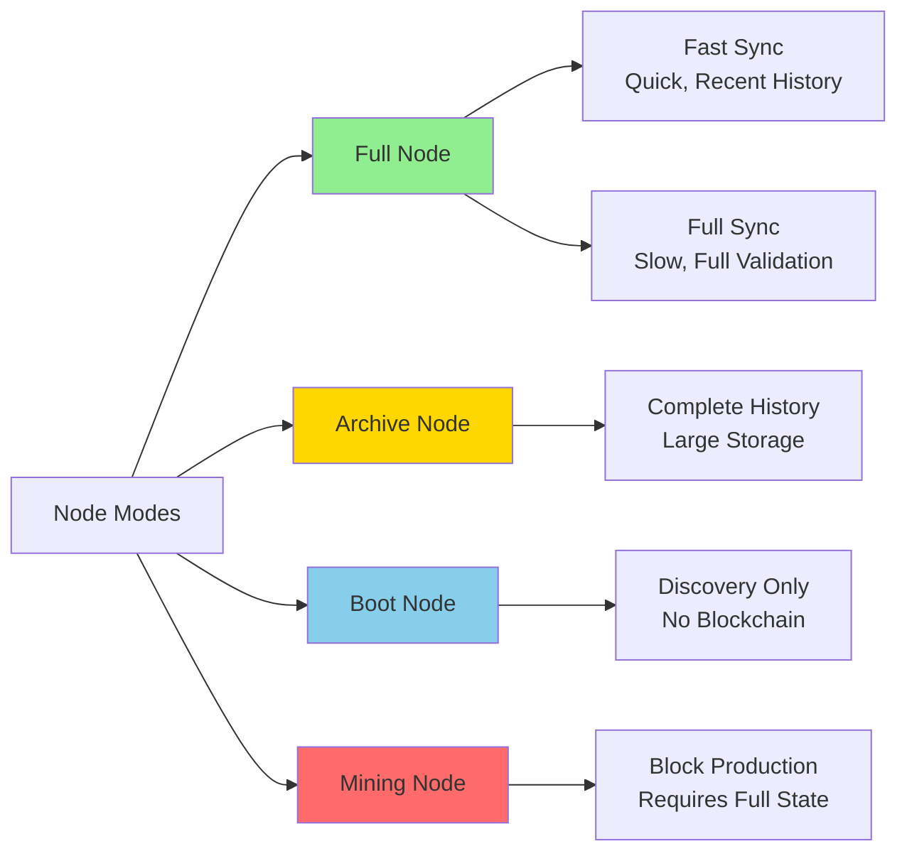
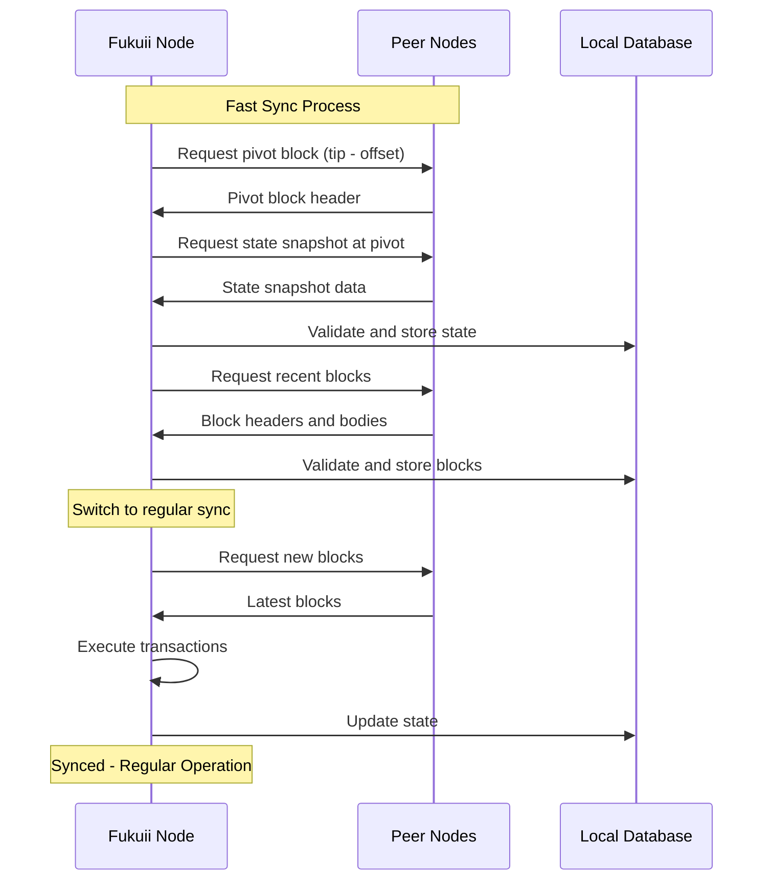
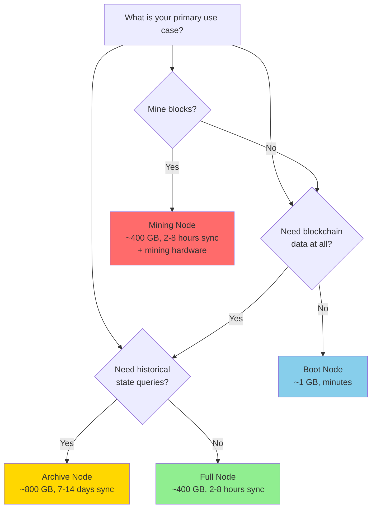

# Operating Modes Runbook

**Audience**: Node operators, system administrators, and DevOps engineers  
**Estimated Time**: 45-60 minutes  
**Prerequisites**: Basic understanding of Ethereum Classic, Linux command line, and Fukuii configuration

## Overview

This runbook provides comprehensive guidance on running Fukuii in different operating modes. Each mode serves specific operational requirements, from running a lightweight bootstrap node to maintaining a complete archive of all historical blockchain state.

Understanding these modes helps operators:
- Choose the right configuration for their use case
- Optimize resource utilization (disk, CPU, memory, network)
- Meet specific operational requirements (serving historical data, mining, peer discovery)
- Plan capacity and infrastructure requirements

## Table of Contents

1. [Operating Mode Overview](#operating-mode-overview)
2. [Full Node (Default)](#full-node-default)
3. [Archive Node](#archive-node)
4. [Boot Node](#boot-node)
5. [Mining Node](#mining-node)
6. [Fast Sync vs Full Sync](#fast-sync-vs-full-sync)
7. [Sync Strategy Comparison](#sync-strategy-comparison)
8. [Mode Selection Guide](#mode-selection-guide)
9. [Configuration Examples](#configuration-examples)
10. [Migration Between Modes](#migration-between-modes)
11. [Troubleshooting](#troubleshooting)

## Operating Mode Overview

Fukuii supports several operating modes, each optimized for different use cases:

| Mode | Disk Space | Sync Time | Use Case | Serves Historical Data |
|------|-----------|-----------|----------|----------------------|
| **Full Node (Fast Sync)** | ~400 GB | Hours | Standard operation, RPC queries | Recent blocks only (~64 blocks history) |
| **Full Node (Full Sync)** | ~400 GB | Days/Weeks | From-genesis validation | Recent blocks only (~64 blocks history) |
| **Archive Node** | ~600-800 GB | Days/Weeks | Historical queries, analytics | All blocks since genesis |
| **Boot Node** | Minimal | Minutes | Peer discovery only | No blockchain data |
| **Mining Node** | ~400 GB+ | Hours+ | Block production | Depends on sync mode |

### Mode Characteristics



## Full Node (Default)

A **Full Node** validates all blocks and maintains the current state of the blockchain. This is the default and most common operating mode.

### Characteristics

- **Default Mode**: No special configuration required
- **Sync Strategy**: Fast sync (downloads state snapshot + recent blocks)
- **State Storage**: Maintains current state with limited history (default: 64 blocks)
- **Pruning**: Enabled (`basic` mode - reference count based pruning)
- **RPC Capabilities**: Full current state queries, limited historical queries
- **Disk Requirements**: ~400 GB (Ethereum Classic as of 2025)
- **Initial Sync Time**: 2-8 hours (depends on network and hardware)

### When to Use

✅ **Use Full Node when:**
- Running a standard ETC node for personal or business use
- Providing RPC endpoints for dApps (current state queries)
- Wallet operations and transaction submission
- General blockchain monitoring and participation
- Resource efficiency is important

❌ **Don't use Full Node when:**
- Need complete historical state queries (use Archive Node)
- Only need peer discovery (use Boot Node)
- Mining blocks (use Mining Node)

### Configuration

Full node is the **default configuration**. No changes needed to `base.conf`:

```hocon
fukuii {
  # Fast sync enabled (default)
  sync {
    do-fast-sync = true
    pivot-block-offset = 32
  }
  
  # Basic pruning enabled (default)
  pruning {
    mode = "basic"
    history = 64
  }
}
```

### Starting a Full Node

**Docker:**
```bash
docker run -d \
  --name fukuii-full \
  --restart unless-stopped \
  -p 9076:9076 \
  -p 30303:30303/udp \
  -v fukuii-data:/app/data \
  ghcr.io/chippr-robotics/chordodes_fukuii:latest
```

**From Distribution:**
```bash
# Default starts in full node mode
./bin/fukuii etc
```

**With Custom Configuration:**
```bash
./bin/fukuii -Dconfig.file=/path/to/full-node.conf etc
```

### Monitoring Full Node

Check sync status:
```bash
curl -X POST --data '{
  "jsonrpc":"2.0",
  "method":"eth_syncing",
  "params":[],
  "id":1
}' http://localhost:8546
```

Expected response (syncing):
```json
{
  "jsonrpc": "2.0",
  "id": 1,
  "result": {
    "startingBlock": "0x0",
    "currentBlock": "0x5f5e10",
    "highestBlock": "0xc9d0b0"
  }
}
```

When synced, returns `false`:
```json
{
  "jsonrpc": "2.0",
  "id": 1,
  "result": false
}
```

### Resource Requirements

| Resource | Minimum | Recommended |
|----------|---------|-------------|
| CPU | 4 cores | 8 cores |
| RAM | 8 GB | 16 GB |
| Disk | 500 GB SSD | 1 TB NVMe SSD |
| Network | 10 Mbps | 100 Mbps |

## Archive Node

An **Archive Node** stores the complete historical state of the blockchain at every block, making it suitable for analytics, historical queries, and block explorers.

### Characteristics

- **State Storage**: Complete historical state for all blocks
- **Pruning**: Disabled (`archive` mode)
- **Sync Strategy**: Full sync from genesis (fast sync not compatible with archive mode)
- **RPC Capabilities**: Full historical queries (e.g., `eth_getBalance` at any block)
- **Disk Requirements**: ~600-800 GB initial, growing ~50-60 GB/year (ETC)
- **Initial Sync Time**: 7-14 days (full validation from genesis)

### When to Use

✅ **Use Archive Node when:**
- Running a block explorer or chain analytics service
- Need historical state queries (account balances, contract state at past blocks)
- Providing public RPC infrastructure with full historical access
- Auditing and compliance requirements
- Research and data analysis

❌ **Don't use Archive Node when:**
- Only need current blockchain state (use Full Node)
- Limited disk space or budget constraints
- Fast initial sync is critical
- Running a personal wallet node

### Configuration

Create `archive-node.conf`:

```hocon
include "base.conf"

fukuii {
  # Disable fast sync - archive requires full sync from genesis
  # Also optimize sync performance
  sync {
    do-fast-sync = false
    max-concurrent-requests = 20
    block-headers-per-request = 256
    block-bodies-per-request = 256
  }
  
  # Archive mode: no pruning
  pruning {
    mode = "archive"
  }
  
  # Optional: Increase peer limits for better connectivity during long sync
  network {
    peer {
      min-outgoing-peers = 30
      max-outgoing-peers = 100
      max-incoming-peers = 50
    }
  }
}
```

### Starting an Archive Node

**Docker:**
```bash
# Create custom config volume
docker run -d \
  --name fukuii-archive \
  --restart unless-stopped \
  -p 9076:9076 \
  -p 30303:30303/udp \
  -v fukuii-archive-data:/app/data \
  -v fukuii-archive-conf:/app/conf \
  -e JAVA_OPTS="-Xms8g -Xmx16g" \
  ghcr.io/chippr-robotics/chordodes_fukuii:latest \
  -Dfukuii.sync.do-fast-sync=false \
  -Dfukuii.pruning.mode=archive
```

**From Distribution:**
```bash
# Start with archive configuration
./bin/fukuii \
  -J-Xms8g -J-Xmx16g \
  -Dfukuii.sync.do-fast-sync=false \
  -Dfukuii.pruning.mode=archive \
  etc
```

**With Configuration File:**
```bash
./bin/fukuii -Dconfig.file=/path/to/archive-node.conf etc
```

### Verifying Archive Mode

Query historical state to verify archive capabilities:

```bash
# Query account balance at an early block (e.g., block 100,000)
# This is well before default pruning history of 64 blocks
curl -X POST --data '{
  "jsonrpc":"2.0",
  "method":"eth_getBalance",
  "params":["0x0000000000000000000000000000000000000000", "0x186A0"],
  "id":1
}' http://localhost:8546
```

Archive node should return the balance at that historical block; full node will likely return an error for blocks outside its pruning history window (~64 blocks).

### Resource Requirements

| Resource | Minimum | Recommended |
|----------|---------|-------------|
| CPU | 8 cores | 16 cores |
| RAM | 16 GB | 32 GB |
| Disk | 1 TB SSD | 2 TB NVMe SSD |
| Network | 100 Mbps | 1 Gbps |

### Archive Node Considerations

**Advantages:**
- ✅ Complete historical state availability
- ✅ Support all RPC queries without limitations
- ✅ Ideal for analytics and block explorers
- ✅ Can serve as authoritative data source

**Disadvantages:**
- ❌ Very long initial sync time (1-2 weeks)
- ❌ Requires significant disk space
- ❌ Higher operational costs
- ❌ More resource-intensive

## Boot Node

A **Boot Node** (or **Discovery Node**) serves as an entry point for new nodes joining the network. It participates in peer discovery but doesn't sync or store blockchain data.

### Characteristics

- **Purpose**: Peer discovery and network bootstrapping
- **Blockchain Sync**: Disabled
- **State Storage**: None
- **Disk Requirements**: Minimal (~100 MB)
- **RPC Capabilities**: None (discovery only)
- **Resource Usage**: Very low

### When to Use

✅ **Use Boot Node when:**
- Operating network infrastructure for peer discovery
- Running a public bootstrap service
- Testing network connectivity
- Lightweight monitoring of network health
- Need to minimize resource usage

❌ **Don't use Boot Node when:**
- Need blockchain data or RPC endpoints
- Want to validate transactions or blocks
- Need to mine or produce blocks

### Configuration

Create `boot-node.conf`:

```hocon
include "base.conf"

fukuii {
  # Disable blockchain synchronization
  sync {
    do-fast-sync = false
  }
  
  # Disable RPC (optional, but boot nodes typically don't serve RPC)
  network {
    rpc {
      http {
        enabled = false
      }
      ipc {
        enabled = false
      }
    }
    
    # Enable and optimize discovery
    discovery {
      discovery-enabled = true
      scan-interval = 30.seconds
      kademlia-bucket-size = 32
    }
    
    # High peer limits for boot node
    peer {
      min-outgoing-peers = 50
      max-outgoing-peers = 200
      max-incoming-peers = 100
    }
  }
  
  # Optional: Configure public-facing address
  # Uncomment and set your public IP/hostname
  # network.discovery.host = "boot.example.com"
}
```

### Starting a Boot Node

**Docker:**
```bash
docker run -d \
  --name fukuii-bootnode \
  --restart unless-stopped \
  -p 30303:30303/udp \
  -v fukuii-bootnode-data:/app/data \
  ghcr.io/chippr-robotics/chordodes_fukuii:latest \
  -Dfukuii.sync.do-fast-sync=false \
  -Dfukuii.network.rpc.http.enabled=false
```

**From Distribution:**
```bash
./bin/fukuii \
  -Dfukuii.sync.do-fast-sync=false \
  -Dfukuii.network.rpc.http.enabled=false \
  -Dfukuii.network.peer.max-outgoing-peers=200 \
  etc
```

### Getting Boot Node Address

To use your boot node, others need your enode URL:

1. **Find Node ID:**
```bash
# Node ID is derived from node.key
# Location: ~/.fukuii/etc/node.key
```

2. **Construct enode URL:**
```
enode://<node-id>@<public-ip>:30303
```

3. **Share with Network:**
Others can add your boot node to their configuration:

```hocon
fukuii.network.discovery.bootstrap-nodes = [
  "enode://your-node-id@your-ip:30303",
  # ... other boot nodes
]
```

### Monitoring Boot Node

Check peer connectivity:
```bash
# View logs for peer connections
tail -f ~/.fukuii/etc/logs/fukuii.log | grep -i "peer\|discovery"
```

Look for messages like:
```
[INFO] Discovery - Found 45 peers in routing table
[INFO] PeerManager - Connected to peer enode://abc123...
```

### Resource Requirements

| Resource | Minimum | Recommended |
|----------|---------|-------------|
| CPU | 1 core | 2 cores |
| RAM | 1 GB | 2 GB |
| Disk | 1 GB | 5 GB |
| Network | 10 Mbps | 50 Mbps |

## Mining Node

A **Mining Node** validates transactions, creates blocks, and participates in consensus by mining new blocks using Proof of Work.

### Characteristics

- **Block Production**: Creates and proposes new blocks
- **Consensus Participation**: Competes in PoW mining
- **State Requirements**: Requires full current state
- **Sync Strategy**: Fast sync acceptable, but must stay synchronized
- **Resource Usage**: High CPU usage during mining

### When to Use

✅ **Use Mining Node when:**
- Participating in network consensus
- Running a mining pool
- Testing mining functionality
- Contributing hashrate to ETC network

❌ **Don't use Mining Node when:**
- On networks that don't use PoW (not applicable to ETC)
- Don't have GPU/ASIC mining hardware
- Only need to observe the network

### Configuration

Create `mining-node.conf`:

```hocon
include "base.conf"

fukuii {
  # Mining configuration
  mining {
    # Your Ethereum address to receive mining rewards
    coinbase = "0xYOUR_ETHEREUM_ADDRESS_HERE"
    
    # Enable mining
    mining-enabled = true
    
    # Number of CPU mining threads (CPU mining is not profitable)
    # For GPU mining, use external mining software with this node's RPC
    num-threads = 4
    
    # Optional: Custom extra data in mined blocks
    header-extra-data = "Fukuii Miner"
    
    # Mining protocol
    protocol = "pow"
  }
  
  # Ensure fast sync for quick start
  sync {
    do-fast-sync = true
  }
  
  # Use basic pruning (mining needs current state, not full history)
  pruning {
    mode = "basic"
    history = 64
  }
  
  # Network configuration
  network {
    # Optimize peer connectivity for miners
    peer {
      min-outgoing-peers = 30
      max-outgoing-peers = 100
    }
    
    # Enable RPC for external miners (getWork/submitWork)
    rpc {
      http {
        enabled = true
        interface = "localhost"  # Use "0.0.0.0" for external miners (SECURITY RISK)
        port = 8546
      }
      
      # Enable mining-related APIs
      # Note: 'personal' API removed for security - manage keys separately
      # 'fukuii' API provides Fukuii-specific methods; use localhost interface for security
      apis = "eth,web3,net,fukuii"
    }
  }
}
```

### Starting a Mining Node

**From Distribution:**
```bash
./bin/fukuii \
  -J-Xms8g -J-Xmx16g \
  -Dfukuii.mining.mining-enabled=true \
  -Dfukuii.mining.coinbase=0xYOUR_ADDRESS \
  etc
```

**With Configuration File:**
```bash
./bin/fukuii -Dconfig.file=/path/to/mining-node.conf etc
```

### Mining with External Software

For GPU/ASIC mining, use external mining software with Fukuii's RPC:

**Example with ethminer:**
```bash
# Start Fukuii mining node (RPC only, no CPU mining)
./bin/fukuii \
  -Dfukuii.mining.coinbase=0xYOUR_ADDRESS \
  -Dfukuii.network.rpc.http.interface=0.0.0.0 \
  etc

# Connect ethminer to Fukuii (use -U for CUDA, -G for OpenCL)
# For local mining on the same machine:
ethminer -U http://127.0.0.1:8546

# For remote mining:
ethminer -U http://YOUR_SERVER_IP:8546
```

### Verifying Mining Status

Check if mining is active:
```bash
curl -X POST --data '{
  "jsonrpc":"2.0",
  "method":"eth_mining",
  "params":[],
  "id":1
}' http://localhost:8546
```

Response:
```json
{
  "jsonrpc": "2.0",
  "id": 1,
  "result": true
}
```

Get current hashrate:
```bash
curl -X POST --data '{
  "jsonrpc":"2.0",
  "method":"eth_hashrate",
  "params":[],
  "id":1
}' http://localhost:8546
```

### Mining Considerations

**Important Notes:**
- ⚠️ **CPU mining is NOT profitable** - Modern ETC mining requires GPUs or ASICs
- ⚠️ **Keep node synchronized** - Mining on an outdated chain wastes resources
- ⚠️ **Set correct coinbase** - Double-check your reward address
- ⚠️ **Monitor network difficulty** - Ensure competitive hashrate

**Mining Pool Alternative:**
Instead of solo mining, consider joining a mining pool for more consistent rewards.

### Resource Requirements

| Resource | Mining with External Miner | CPU Mining (Not Recommended) |
|----------|---------------------------|------------------------------|
| CPU | 8 cores | 16+ cores |
| RAM | 16 GB | 16 GB |
| Disk | 500 GB SSD | 500 GB SSD |
| Network | 100 Mbps | 100 Mbps |
| GPU | Mining GPU required | N/A |

## Fast Sync vs Full Sync

Fukuii supports two synchronization strategies that affect initial sync time and validation approach.

### Sync Strategy Comparison

```mermaid
graph TB
    subgraph "Fast Sync"
        A[Start] --> B[Download Recent State Snapshot]
        B --> C[Download Recent Block Headers]
        C --> D[Download & Validate Recent Blocks]
        D --> E[Continue Regular Sync]
        E --> F[Synced]
    end
    
    subgraph "Full Sync"
        G[Start] --> H[Download Block Headers from Genesis]
        H --> I[Download All Block Bodies]
        I --> J[Execute All Transactions]
        J --> K[Build Complete State]
        K --> L[Synced]
    end
    
    style A fill:#90EE90
    style G fill:#FFD700
    style F fill:#87CEEB
    style L fill:#87CEEB
```



### Fast Sync (Default)

**How It Works:**
1. Downloads a state snapshot from near the chain tip (~32 blocks behind)
2. Downloads recent block headers and bodies
3. Validates the snapshot and recent blocks
4. Continues with regular synchronization

**Configuration:**
```hocon
fukuii.sync.do-fast-sync = true
```

**Characteristics:**
- ⚡ **Fast**: 2-8 hours to sync
- 💾 **Efficient**: Downloads state snapshot, not all historical transactions
- ✅ **Secure**: Validates state snapshot cryptographically
- 📊 **Limited History**: Only maintains ~64 blocks of state history

**When to Use:**
- Default for most deployments
- When fast initial sync is priority
- Standard full node operation
- Resource-efficient setup

### Full Sync

**How It Works:**
1. Downloads all block headers from genesis to current
2. Downloads all block bodies and transactions
3. Executes every transaction from genesis
4. Builds complete state by replaying entire chain history

**Configuration:**
```hocon
fukuii.sync.do-fast-sync = false
```

**Characteristics:**
- 🐢 **Slow**: 7-14 days to sync
- 🔍 **Complete Validation**: Executes and validates every transaction
- 📚 **Full History**: Can maintain complete historical state (with archive mode)
- 💪 **Maximum Security**: Independent verification of entire chain

**When to Use:**
- Running an archive node (required)
- Maximum security and independence
- Research and auditing purposes
- When time is not critical

### Sync Mode Configuration Examples

**Fast Sync (Default):**
```bash
./bin/fukuii etc  # Fast sync enabled by default
```

**Full Sync:**
```bash
./bin/fukuii -Dfukuii.sync.do-fast-sync=false etc
```

**Fast Sync with Custom Pivot Offset:**
```bash
./bin/fukuii \
  -Dfukuii.sync.do-fast-sync=true \
  -Dfukuii.sync.pivot-block-offset=64 \
  etc
```

## Sync Strategy Comparison

| Aspect | Fast Sync | Full Sync |
|--------|-----------|-----------|
| **Initial Sync Time** | 2-8 hours | 7-14 days |
| **Disk I/O During Sync** | Moderate | Very High |
| **Network Bandwidth** | ~200-300 GB | ~400 GB+ |
| **CPU Usage During Sync** | Moderate | High |
| **Historical State** | Limited (~64 blocks) | Can be complete (with archive mode) |
| **Security Model** | Cryptographic snapshot validation | Full transaction execution |
| **Archive Node Compatible** | ❌ No | ✅ Yes |
| **Mining Ready** | ✅ Yes (after sync) | ✅ Yes (after sync) |
| **Recommended For** | Most users, production deployments | Archive nodes, maximum security |

### Detailed Sync Process Flow



## Mode Selection Guide

Choose the right operating mode based on your requirements:

### Decision Matrix



### Use Case Recommendations

| Use Case | Recommended Mode | Rationale |
|----------|------------------|-----------|
| **Personal Wallet** | Full Node (Fast Sync) | Quick sync, minimal resources, full functionality |
| **dApp Backend** | Full Node (Fast Sync) | Current state queries, reasonable resources |
| **Block Explorer** | Archive Node (Full Sync) | Complete historical queries required |
| **Analytics Platform** | Archive Node (Full Sync) | Historical state analysis |
| **Public RPC Service** | Archive Node (Full Sync) | Serve all RPC query types |
| **Mining Operation** | Mining Node (Fast Sync) | Quick start, focus on mining |
| **Network Infrastructure** | Boot Node | Peer discovery service, minimal resources |
| **Development/Testing** | Full Node (Fast Sync) | Quick setup for development |
| **Regulatory Compliance** | Archive Node (Full Sync) | Complete audit trail required |

## Configuration Examples

### Example 1: Standard Full Node

**File:** `full-node.conf`

```hocon
include "base.conf"

fukuii {
  # Network selection is in base.conf via include chain
  
  # Fast sync for quick start
  sync {
    do-fast-sync = true
    pivot-block-offset = 32
  }
  
  # Basic pruning
  pruning {
    mode = "basic"
    history = 64
  }
  
  # Standard peer configuration
  network {
    peer {
      min-outgoing-peers = 20
      max-outgoing-peers = 50
      max-incoming-peers = 30
    }
    
    rpc {
      http {
        enabled = true
        interface = "localhost"
        port = 8546
      }
      apis = "eth,web3,net"
    }
  }
}
```

**Start:**
```bash
./bin/fukuii -Dconfig.file=full-node.conf etc
```

### Example 2: High-Performance Archive Node

**File:** `archive-node-optimized.conf`

```hocon
include "base.conf"

fukuii {
  # Full sync from genesis
  sync {
    do-fast-sync = false
    
    # Optimize sync performance
    max-concurrent-requests = 30
    block-headers-per-request = 384
    block-bodies-per-request = 384
  }
  
  # Archive mode - no pruning
  pruning {
    mode = "archive"
  }
  
  # High peer limits for better connectivity
  network {
    peer {
      min-outgoing-peers = 40
      max-outgoing-peers = 150
      max-incoming-peers = 75
    }
    
    rpc {
      http {
        enabled = true
        interface = "0.0.0.0"  # ⚠️ Use firewall/proxy
        port = 8546
        
        # Rate limiting for public access
        rate-limit {
          enabled = true
          min-request-interval = 100.milliseconds
        }
      }
      
      # Full API suite for archive node
      # Note: 'personal' API removed for security - manage keys separately
      apis = "eth,web3,net,fukuii,debug"
    }
  }
  
  # Optimize database
  db {
    rocksdb {
      # Larger cache for better performance
      block-cache-size = 268435456  # 256 MB
      
      # Optimize write performance during sync
      # (these are advanced settings, use with caution)
    }
  }
}
```

**Start with JVM optimization:**
```bash
./bin/fukuii \
  -J-Xms16g \
  -J-Xmx32g \
  -J-XX:+UseG1GC \
  -J-XX:MaxGCPauseMillis=200 \
  -Dconfig.file=archive-node-optimized.conf \
  etc
```

### Example 3: Public Boot Node

**File:** `boot-node.conf`

```hocon
include "base.conf"

fukuii {
  # No blockchain sync
  sync {
    do-fast-sync = false
  }
  
  # Minimal pruning config (not used since not syncing)
  pruning {
    mode = "basic"
  }
  
  network {
    # Set your public IP/hostname
    discovery {
      discovery-enabled = true
      host = "boot.example.com"  # Your public hostname
      port = 30303
      scan-interval = 20.seconds
      kademlia-bucket-size = 64
    }
    
    # High peer capacity
    peer {
      min-outgoing-peers = 100
      max-outgoing-peers = 500
      max-incoming-peers = 200
    }
    
    # Disable RPC
    rpc {
      http {
        enabled = false
      }
      ipc {
        enabled = false
      }
    }
  }
}
```

**Start:**
```bash
./bin/fukuii \
  -J-Xms2g \
  -J-Xmx4g \
  -Dconfig.file=boot-node.conf \
  etc
```

### Example 4: Mining Pool Node

**File:** `mining-pool.conf`

```hocon
include "base.conf"

fukuii {
  mining {
    coinbase = "0xYOUR_POOL_ADDRESS"
    mining-enabled = false  # External miners via RPC
    header-extra-data = "My Mining Pool"
    protocol = "pow"
  }
  
  # Fast sync for quick start
  sync {
    do-fast-sync = true
  }
  
  # Basic pruning sufficient for mining
  pruning {
    mode = "basic"
    history = 64
  }
  
  # Strong peer connectivity
  network {
    peer {
      min-outgoing-peers = 50
      max-outgoing-peers = 150
      max-incoming-peers = 100
    }
    
    rpc {
      http {
        enabled = true
        # ⚠️ SECURITY WARNING: Exposes RPC to all network interfaces
        # Ensure proper firewall rules, consider reverse proxy with authentication
        # or use VPN for production deployments
        interface = "0.0.0.0"
        port = 8546
        
        # Rate limiting for miner requests
        rate-limit {
          enabled = true
          min-request-interval = 50.milliseconds
        }
      }
      
      # Mining-related APIs (includes fukuii for mining-specific methods)
      # ⚠️ SECURITY: fukuii API may contain administrative methods
      # Consider restricting API list for public-facing deployments
      apis = "eth,web3,net,fukuii"
    }
  }
}
```

**Start:**
```bash
./bin/fukuii \
  -J-Xms8g \
  -J-Xmx16g \
  -Dconfig.file=mining-pool.conf \
  etc
```

### Example 5: Docker Compose Multi-Mode Setup

**File:** `docker-compose.yml`

```yaml
version: '3.8'

services:
  # Full node for general use
  fukuii-full:
    image: ghcr.io/chippr-robotics/chordodes_fukuii:latest
    container_name: fukuii-full
    restart: unless-stopped
    ports:
      - "9076:9076"
      - "30303:30303/udp"
      - "127.0.0.1:8546:8546"
    volumes:
      - fukuii-full-data:/app/data
    environment:
      - JAVA_OPTS=-Xms8g -Xmx16g
    command: etc
    
  # Archive node for historical queries
  fukuii-archive:
    image: ghcr.io/chippr-robotics/chordodes_fukuii:latest
    container_name: fukuii-archive
    restart: unless-stopped
    ports:
      - "9077:9076"
      - "30304:30303/udp"
      - "127.0.0.1:8547:8546"
    volumes:
      - fukuii-archive-data:/app/data
    environment:
      - JAVA_OPTS=-Xms16g -Xmx32g
    command: >
      etc
      -Dfukuii.sync.do-fast-sync=false
      -Dfukuii.pruning.mode=archive
      -Dfukuii.network.server-address.port=9077
      -Dfukuii.network.discovery.port=30304
    
  # Boot node for peer discovery
  fukuii-boot:
    image: ghcr.io/chippr-robotics/chordodes_fukuii:latest
    container_name: fukuii-boot
    restart: unless-stopped
    ports:
      - "30305:30303/udp"
    volumes:
      - fukuii-boot-data:/app/data
    environment:
      - JAVA_OPTS=-Xms2g -Xmx4g
    command: >
      etc
      -Dfukuii.sync.do-fast-sync=false
      -Dfukuii.network.rpc.http.enabled=false
      -Dfukuii.network.discovery.port=30305

volumes:
  fukuii-full-data:
  fukuii-archive-data:
  fukuii-boot-data:
```

**Start all services:**
```bash
docker-compose up -d
```

## Migration Between Modes

Switching between operating modes requires careful planning and may involve re-syncing.

### Full Node → Archive Node

**Requirements:**
- Must re-sync from genesis with archive mode
- Cannot convert pruned database to archive

**Steps:**

1. **Stop Current Node:**
```bash
# Docker
docker stop fukuii

# Direct
pkill -f fukuii
```

2. **Backup Data (Optional):**
```bash
cp -r ~/.fukuii/etc ~/.fukuii/etc.backup
```

3. **Clear Database:**
```bash
rm -rf ~/.fukuii/etc/rocksdb/
```

4. **Update Configuration:**
```bash
# Create archive-node.conf with archive settings
cat > archive-node.conf << 'EOF'
include "base.conf"

fukuii {
  sync.do-fast-sync = false
  pruning.mode = "archive"
}
EOF
```

5. **Restart with Archive Mode:**
```bash
./bin/fukuii -Dconfig.file=archive-node.conf etc
```

6. **Monitor Sync Progress:**
```bash
tail -f ~/.fukuii/etc/logs/fukuii.log
```

**Expected Downtime:** 7-14 days (full sync)

### Archive Node → Full Node

**Requirements:**
- Can keep existing data if desired
- Fast sync will download new state snapshot

**Steps:**

1. **Stop Archive Node:**
```bash
docker stop fukuii-archive
```

2. **Option A: Keep Archive Data (Safe)**
```bash
# Just change configuration
# Archive data includes full node data
# Simply run with new config
./bin/fukuii \
  -Dfukuii.sync.do-fast-sync=true \
  -Dfukuii.pruning.mode=basic \
  etc
```

3. **Option B: Fresh Sync (Faster, Less Disk)**
```bash
# Remove database
rm -rf ~/.fukuii/etc/rocksdb/

# Start with full node config
./bin/fukuii etc  # Uses defaults (fast sync + basic pruning)
```

**Expected Downtime:** 
- Option A: Immediate (just restart)
- Option B: 2-8 hours (fast sync)

### Full Node → Mining Node

**Requirements:**
- Keep existing synchronized data
- Add mining configuration

**Steps:**

1. **Verify Sync Status:**
```bash
curl -X POST --data '{"jsonrpc":"2.0","method":"eth_syncing","params":[],"id":1}' \
  http://localhost:8546
```

2. **Stop Node:**
```bash
docker stop fukuii
```

3. **Update Configuration:**
```bash
# Add to configuration file
fukuii.mining.mining-enabled = true
fukuii.mining.coinbase = "0xYOUR_ADDRESS"
```

4. **Restart with Mining:**
```bash
./bin/fukuii \
  -Dfukuii.mining.mining-enabled=true \
  -Dfukuii.mining.coinbase=0xYOUR_ADDRESS \
  etc
```

**Expected Downtime:** Seconds to minutes (just restart)

### Mode Migration Summary

| Migration | Data Preservation | Sync Required | Downtime |
|-----------|------------------|---------------|----------|
| Full → Archive | ❌ Must re-sync | ✅ Full sync from genesis | 7-14 days |
| Archive → Full | ✅ Can keep data | ❌ No re-sync needed | Minutes |
| Full → Mining | ✅ Keep data | ❌ No re-sync needed | Minutes |
| Mining → Full | ✅ Keep data | ❌ No re-sync needed | Minutes |
| Any → Boot | ❌ Remove blockchain data | ❌ No blockchain sync | Minutes |
| Boot → Any | ❌ No blockchain data | ✅ Full sync required | Varies |

## Troubleshooting

### General Issues

#### Node Not Syncing

**Symptoms:**
- Sync progress stuck
- No new blocks received
- `eth_syncing` shows same block for extended period

**Solutions:**

1. **Check peer connectivity:**
```bash
# View peer count via RPC
curl -X POST --data '{"jsonrpc":"2.0","method":"net_peerCount","params":[],"id":1}' \
  http://localhost:8546
```

Expected: `"result": "0x14"` (20 peers or more)

2. **Verify network ports:**
```bash
# Check if ports are open
netstat -tulpn | grep -E "9076|30303"
```

3. **Check logs for errors:**
```bash
tail -f ~/.fukuii/etc/logs/fukuii.log | grep -i "error\|exception"
```

4. **Restart with known peers:**
```bash
./bin/fukuii -Dfukuii.network.discovery.reuse-known-nodes=true etc
```

#### Out of Disk Space

**Symptoms:**
- Node crashes or stops syncing
- Database errors in logs
- `df -h` shows 100% disk usage

**Solutions:**

1. **Check disk space:**
```bash
df -h ~/.fukuii/
du -sh ~/.fukuii/etc/*
```

2. **Clear logs:**
```bash
rm ~/.fukuii/etc/logs/fukuii.*.log.zip
```

3. **For full node, verify pruning is enabled:**
```bash
# Should see: mode = "basic" in config
grep -r "pruning" ~/.fukuii/etc/
```

4. **Consider upgrading to larger disk or switching mode**

### Mode-Specific Issues

#### Archive Node: Slow Sync

**Problem:** Archive node taking very long to sync

**Solutions:**

1. **Increase concurrent requests:**
```bash
./bin/fukuii \
  -Dfukuii.sync.max-concurrent-requests=40 \
  -Dfukuii.sync.block-headers-per-request=512 \
  etc
```

2. **More peers:**
```bash
./bin/fukuii \
  -Dfukuii.network.peer.max-outgoing-peers=150 \
  etc
```

3. **Optimize JVM:**
```bash
./bin/fukuii \
  -J-Xms16g \
  -J-Xmx32g \
  -J-XX:+UseG1GC \
  -J-XX:MaxGCPauseMillis=200 \
  etc
```

4. **Use faster storage (NVMe SSD)**

#### Boot Node: No Incoming Connections

**Problem:** Boot node not receiving incoming peer connections

**Solutions:**

1. **Verify port forwarding:**
```bash
# Test from external host
nc -zvu YOUR_PUBLIC_IP 30303
```

2. **Check firewall:**
```bash
# Allow UDP 30303
sudo ufw allow 30303/udp
```

3. **Set public hostname:**
```bash
./bin/fukuii \
  -Dfukuii.network.discovery.host=your.public.ip \
  etc
```

4. **Verify node is discoverable:**
```bash
# Check logs for "Bound" message
grep "Bound" ~/.fukuii/etc/logs/fukuii.log
```

#### Mining Node: Not Mining Blocks

**Problem:** Mining enabled but no blocks produced

**Solutions:**

1. **Verify mining is enabled:**
```bash
curl -X POST --data '{"jsonrpc":"2.0","method":"eth_mining","params":[],"id":1}' \
  http://localhost:8546
```

Expected: `"result": true`

2. **Check node is synced:**
```bash
curl -X POST --data '{"jsonrpc":"2.0","method":"eth_syncing","params":[],"id":1}' \
  http://localhost:8546
```

Expected: `"result": false` (synced)

3. **Verify coinbase set:**
```bash
curl -X POST --data '{"jsonrpc":"2.0","method":"eth_coinbase","params":[],"id":1}' \
  http://localhost:8546
```

4. **Check hashrate:**
```bash
curl -X POST --data '{"jsonrpc":"2.0","method":"eth_hashrate","params":[],"id":1}' \
  http://localhost:8546
```

5. **Note: CPU mining is not profitable**
   - Consider connecting external GPU/ASIC miners
   - Or join a mining pool

#### Fast Sync: Pivot Block Selection Failed

**Problem:** Fast sync fails to select pivot block

**Solutions:**

1. **Increase minimum peers:**
```bash
./bin/fukuii \
  -Dfukuii.sync.min-peers-to-choose-pivot-block=10 \
  etc
```

2. **Adjust pivot block offset:**
```bash
./bin/fukuii \
  -Dfukuii.sync.pivot-block-offset=64 \
  etc
```

3. **Ensure sufficient peers:**
```bash
curl -X POST --data '{"jsonrpc":"2.0","method":"net_peerCount","params":[],"id":1}' \
  http://localhost:8546
```

Need 5+ peers for pivot selection.

4. **Check network connectivity:**
```bash
ping 8.8.8.8
```

### Performance Issues

#### High CPU Usage

**Problem:** Fukuii consuming too much CPU

**Causes & Solutions:**

1. **During sync (expected):**
   - Transaction execution is CPU-intensive
   - Will decrease after sync completes

2. **Mining enabled:**
```bash
# Reduce mining threads or disable
-Dfukuii.mining.num-threads=2
-Dfukuii.mining.mining-enabled=false
```

3. **Too many peers:**
```bash
# Reduce peer limits
-Dfukuii.network.peer.max-outgoing-peers=30
```

#### High Memory Usage

**Problem:** Fukuii using too much RAM

**Solutions:**

1. **Reduce JVM heap:**
```bash
./bin/fukuii -J-Xms4g -J-Xmx8g etc
```

2. **Reduce node cache:**
```bash
-Dfukuii.node-caching.max-size=200000
```

3. **Monitor with:**
```bash
# Check JVM memory
jps | grep Fukuii
jstat -gc <PID> 1000
```

#### Slow RPC Responses

**Problem:** RPC queries taking too long

**Solutions:**

1. **Enable rate limiting (if overloaded):**
```bash
-Dfukuii.network.rpc.http.rate-limit.enabled=true
```

2. **Increase database cache:**
```bash
-Dfukuii.db.rocksdb.block-cache-size=536870912  # 512 MB
```

3. **For historical queries, use archive node**

4. **Consider dedicated RPC infrastructure**

## Related Documentation

- **[Node Configuration](node-configuration.md)** - Detailed configuration reference
- **[First Start](first-start.md)** - Initial node setup guide
- **[Peering](peering.md)** - Network connectivity and peer management
- **[Disk Management](disk-management.md)** - Storage optimization and monitoring
- **[Security](security.md)** - Security best practices for node operation
- **[Metrics & Monitoring](../operations/metrics-and-monitoring.md)** - Observability and monitoring

## Additional Resources

- [Ethereum Classic Documentation](https://ethereumclassic.org/)
- [Fukuii GitHub Repository](https://github.com/chippr-robotics/fukuii)
- [Docker Documentation](../../docker/README.md)
- [Architecture Overview](../architecture-overview.md)

---

**Document Version**: 1.0  
**Last Updated**: 2025-11-06  
**Maintainer**: Chippr Robotics LLC
